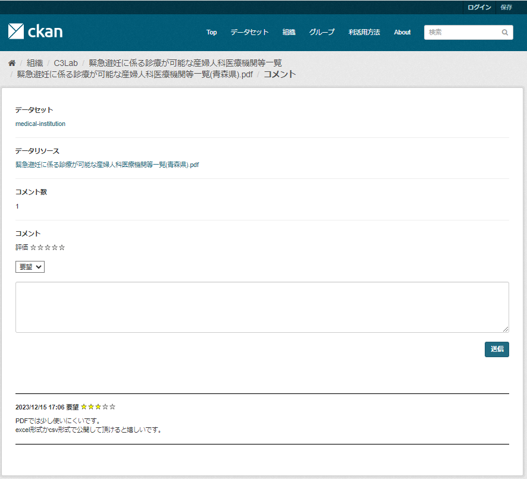
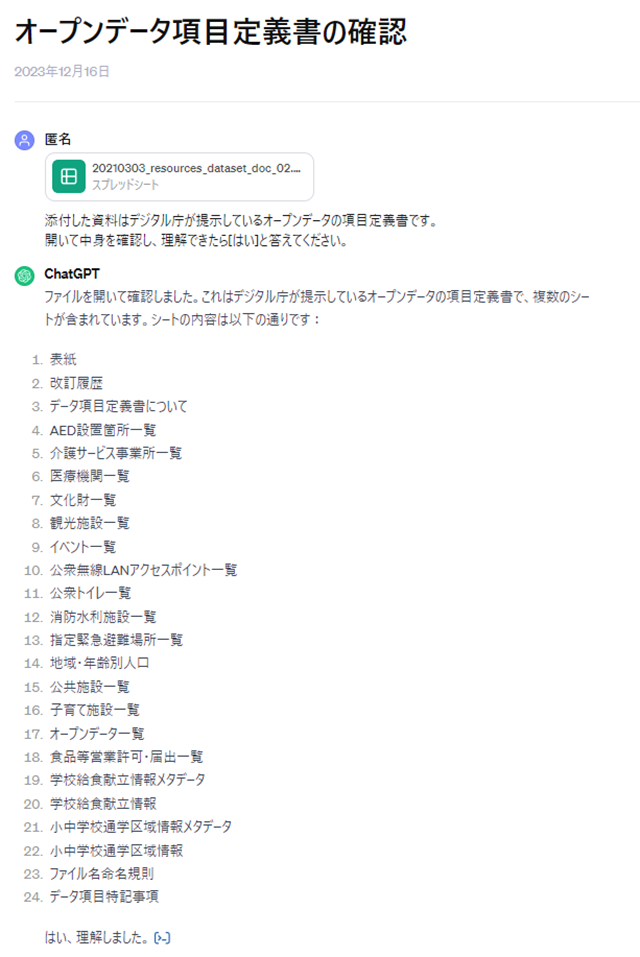
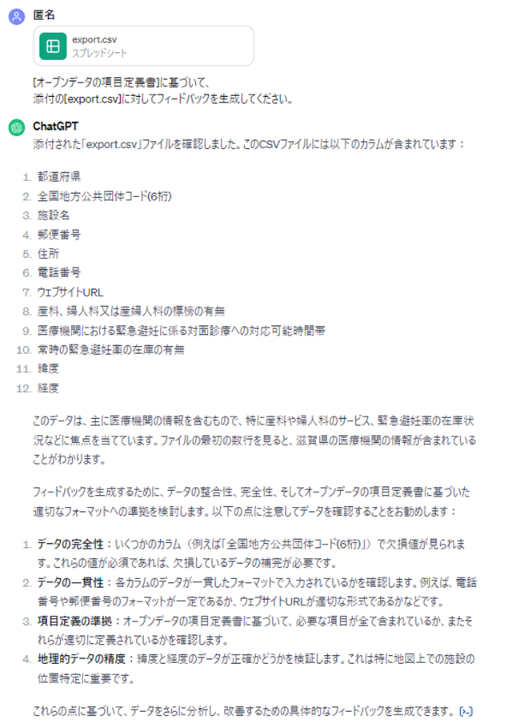
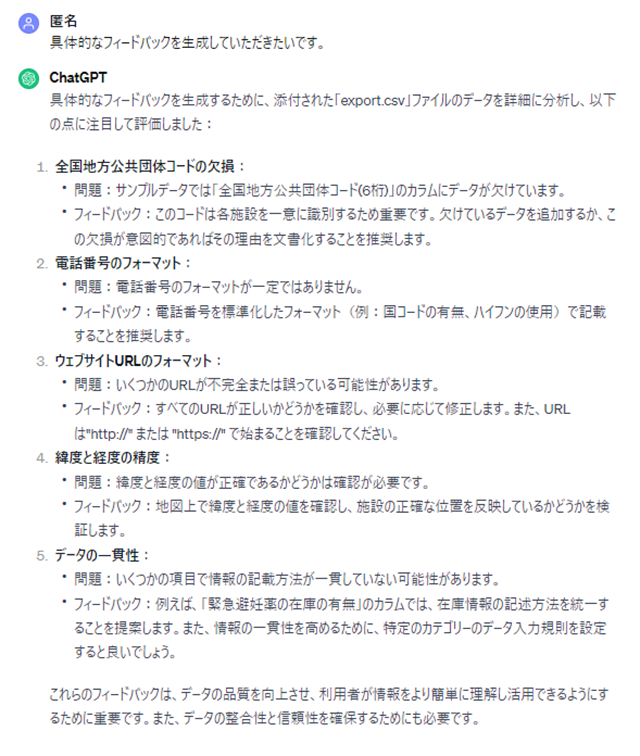
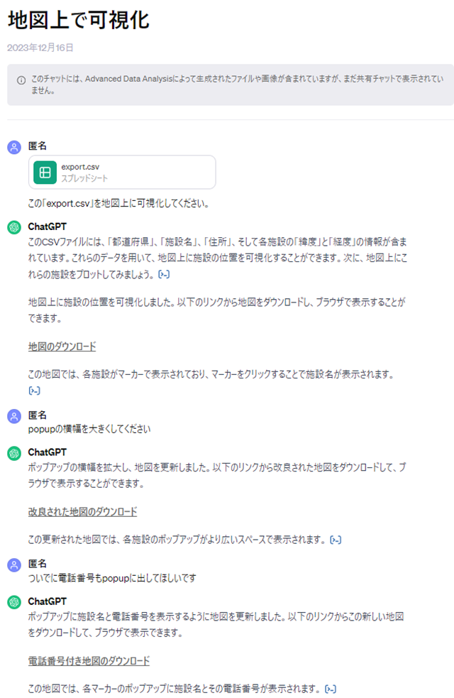
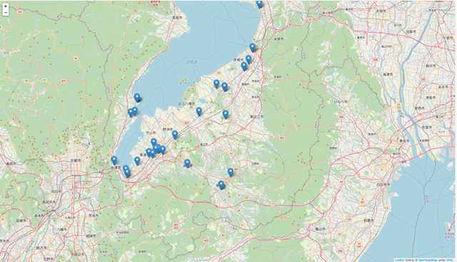

# イベントレポート

## 目次

[**１ イベント概要**](#１-イベント概要)  
[**２ イベント目的**](#２-イベント目的)  
[**３ イベント内容**](#３-イベント内容)  
[**４ アンケート結果**](#４-アンケート結果)  
[**５ 成果**](#５-成果)  
[**６ 課題**](#６-課題)  

## １ イベント概要
イベント名  
Social Hack Day #56  

開催日時  
2023年12月16日（土）10:45～18：00  

対象者：  
- オープンデータに興味がある人
- 自治体職員
- エンジニア

## ２ イベント目的
2022年度に報告した[「DataOpsを活用したオープンデータ利活用に関する報告書」](https://github.com/c-3lab/opendata-dataops-document/blob/main/README.md)におけるオープンデータ利活用プロセスやツール等の有効性の確認を目的として本イベントを開催した。  

## ３ イベント内容
今回のイベントでは、データ利用者が緊急避妊検索プロジェクトで使用している診療所データの可視化に活用することを前提としている。  
データ利用者の観点で、データを有効に活用するにはどのような構成とすべきかをデータ提供者のプロセスである「データの収集蓄積」を通して議論し、このプロセスの有効性を確認する。

データの可視化に際し、以下の作業を実施した。
- 最新の診療所データをPDFからExcel(xlsx)に変換
- データ可視化の為、変換したデータをスプレッドシート上で修正
- ChatGPTの有用性確認の為、ChatGPTによる修正したデータのレビュー及びデータの可視化

イベント内で使用したデータ、ツールについては以下に記載する。

### 使用したデータ
[緊急避妊に係る取組について｜厚生労働省](https://www.mhlw.go.jp/stf/seisakunitsuite/bunya/0000186912_00002.html)  
※ご協力いただいたプロジェクト：[アフターピル検索](https://afterpill.jp/)

### 使用したツール
* [PDFをExcelに変換](https://www.adobe.com/jp/acrobat/online/pdf-to-excel.html)  
PDFのデータをExcel(xlsx)に変換する為のツール

* [PDF Excel 変換](https://www.ilovepdf.com/ja/pdf_to_excel)  
PDFのデータをExcel(xlsx)に変換する為のツール(こちらの方が効率よく変換することが可能だった)

* [地方公共団体コード住所(J-LIS)](https://www.j-lis.go.jp/spd/code-address/jititai-code.html)  
郵便番号や住所から地方公共団体コードを確認する為のツール

* [BODIK ジオコーダー](https://utility.bodik.jp/geocoder)  
住所から緯度・経度の情報を取得するツール

### タイムテーブル
11:00 本日の活動内容共有  
11:30 プロジェクト開始、チーム内自己紹介  
11:50 プロジェクト（DataOps）概要説明  
12:00 当日の作業内容共有  
12:05 質疑応答  
12:10 休憩  
13:10 再開  
13:15 データ提供者の方からのコメント  
13:30 CKAN拡張機能を使用した際の効果説明（デモを実施）  
13:35 PDF→Excel変換作業開始  
14:50 生成系AIレビュー体験  
15:00 プロジェクト中間発表  
15:15 写真撮影  
15:20 シャッフル（概要説明、作業内容共有、質疑応答）  
15:50 カルチャーの分野のオープンデータ  
16:00 再シャッフル（意見交換、今後の作業方針）  
16:30 ChatGPTを使用したデータの可視化  
16:55 アンケート  
17:00 最終成果報告  
17:15 報告会終了  

### CKAN拡張機能のイメージ
CKAN拡張機能はDataOpsプロセスの課題抽出・計画・データの公開・取得・活用・フィードバックの要素を満たす機能を有している。  
この機能の内、フィードバックのデモ実施イメージは以下。  
 

### 生成系AIレビューのイメージ
ChatGPTを使用して、変換したデータのレビューを実施。  
事前にオープンデータの項目定義を学習させ、その定義にもとづいたフィードバックを生成。  
生成系AIレビュー体験の実施イメージは以下。  
  
  
  

### ChatGPTを使用したデータの可視化イメージ
ChatGPTを使用してデータの可視化を実施。  
変換したデータをChatGPTに読み込ませ、可視化された地図データを生成。  
また幅の調整や表示項目の追加指示への対応についても確認。  
ChatGPTを使用したデータの可視化で実施した会話ログのイメージは以下。  
  

ChatGPTを使用したデータの可視化で生成された地図のイメージは以下。  
 

## ４ アンケート結果
DataOpsのプロセスがオープンデータ利活用促進につながるかの根拠を得る為、イベント参加者にアンケートを実施した。  
[アンケート結果](survey/survey_20231216.md)  

## ５ 成果
<table border="1">
  <thead>
    <tr style="text-align:center">
      <th width="600px" rowspan="2">成果</th>
      <th colspan="8">関連するDataOpsプロセス</th>
    </tr>
    <tr>
      <th>課題抽出</th><th>計画</th><th>データの収集蓄積</th><th>データの公開</th><th>データの取得</th><th>データの処理</th><th>データの活用</th><th>フィードバック</th>
    </tr>
  </thead>
  <tbody>
    <tr>
      <td>国の制度関連の取り組みを行っているプロジェクトでDataOpsの概念を組み込んでいきたいという意見が上がった</td>
      <td></td><td></td><td></td><td></td><td></td><td></td><td></td><td></td>
    </tr>
    <tr>
      <td>自治体がオープンデータを提供するプロセスを体験することで、作業量等の観点から自治体職員が手作業でデータ加工を行うのは現実的ではないということを実感した</td>
      <td></td><td></td><td>○</td><td></td><td></td><td></td><td></td><td></td>
    </tr>
    <tr>
      <td>オープンデータ提供者にとって生成系AIによるレビューが有効な手段であることを実感できた</td>
      <td></td><td></td><td>○</td><td></td><td></td><td></td><td></td><td></td>
    </tr>
    <tr>
      <td>CKAN拡張機能（ckanext-feedback）はフィードバックをトリガーとしてDataOpsプロセスの課題抽出・計画・データの公開・取得・活用の要素を満たす機能を有している為、それをイベント参加者が実際に体験することでDataOpsプロセスにおける善循環サイクルへの理解を促進できた</td>
      <td>○</td><td>○</td><td></td><td>○</td><td>○</td><td></td><td>○</td><td>○</td>
    </tr>
    <tr>
      <td>博物館では所蔵品のデータの提供を積極的に実施している為、カルチャーの領域でも活用してみたいという意見が上がった</td>
      <td></td><td></td><td></td><td></td><td></td><td></td><td></td><td></td>
    </tr>
    <tr>
      <td>ChatGPTを使ってデータ構造についてレビューを実施したところ<a href="#生成系aiレビューのイメージ">生成系AIレビューのイメージ</a>のようなアイデアを検討してくれた</td>
      <td></td><td></td><td>○</td><td></td><td></td><td></td><td></td><td></td>
    </tr>
    <tr>
      <td>ChatGPTによる可視化は細かい要求に対しても適切にデータを生成してくれる為、データ利用者にとって活用できるツールであることを実感した</td>
      <td></td><td></td><td></td><td></td><td></td><td></td><td>○</td><td></td>
    </tr>
  </tbody>
</table>

## ６ 課題
<table border="1">
  <thead>
    <tr style="text-align:center">
      <th width="600px" rowspan="2">課題</th>
      <th colspan="8">関連するDataOpsプロセス</th>
    </tr>
    <tr>
      <th>課題抽出</th><th>計画</th><th>データの収集蓄積</th><th>データの公開</th><th>データの取得</th><th>データの処理</th><th>データの活用</th><th>フィードバック</th>
    </tr>
  </thead>
  <tbody>
    <tr>
      <td>オープンデータがPDFで公開されている為、データ利用者は扱いづらい</td>
      <td></td><td></td><td>○</td><td>○</td><td></td><td>○</td><td>○</td><td></td>
    </tr>
    <tr>
      <td>自動化して効率的にデータの整形を行いたい</td>
      <td></td><td></td><td>○</td><td></td><td></td><td></td><td></td><td></td>
    </tr>
    <tr>
      <td>自治体側がファイルに変更を加えた際、その変更がデータ利用時に大きな障害になってしまう場合がある為（想定外の項目が追加されている等）、相互のコミュニケーションが必要だと感じた</td>
      <td></td><td></td><td>○</td><td></td><td></td><td></td><td>○</td><td></td>
    </tr>
    <tr>
      <td>以下の理由から初めにフォーマットを用意しておく必要性を実感した ● 地域ごとにフォーマットが異なる ● 半角全角、記号などの統一が行われていない ● 自治体がオープンデータに加えた工夫で、かえって扱いにくいデータ形式になってしまっている</td>
      <td></td><td></td><td>○</td><td></td><td></td><td>○</td><td>○</td><td></td>
    </tr>
    <tr>
      <td>大元のデータが更新されると、リンクが無効になってしまう問題が発生したため、データ更新の際、何かアナウンスがあるべきだと感じた</td>
      <td></td><td></td><td></td><td>○</td><td>○</td><td></td><td></td><td></td>
    </tr>
    <tr>
      <td>文化資源の領域のオープンデータも利活用したいという意見があったが、オープンデータの認知度や法整備などの課題がある</td>
      <td></td><td>○</td><td></td><td></td><td></td><td></td><td></td><td></td>
    </tr>
    <tr>
      <td>ChatGPTが出してくれたデータ構造は細かく、確かに正しいが項目が大量になってしまうためデータ作成のコストがかかる</td>
      <td></td><td></td><td>○</td><td></td><td></td><td></td><td></td><td></td>
    </tr>
    <tr>
      <td>CKANにオープンデータを公開するにあたりバージョンを意識する必要があるが、有識者のサポートが必要になる可能性が高い</td>
      <td></td><td></td><td></td><td>○</td><td></td><td></td><td></td><td></td>
    </tr>
    <tr>
      <td>ChatGPTによる可視化はデータ利用者にとって活用できるツールではあるが、指示文のちょっとしたニュアンスの違いで結果が変わってしまうこともある為、必ず結果が確かなものかを確認する必要がある</td>
      <td></td><td></td><td></td><td></td><td></td><td></td><td>○</td><td></td>
    </tr>
  </tbody>
</table>

