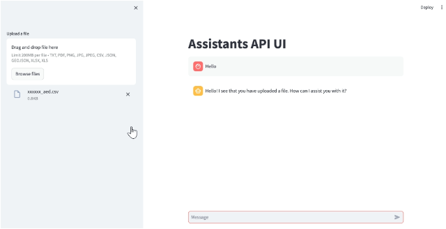
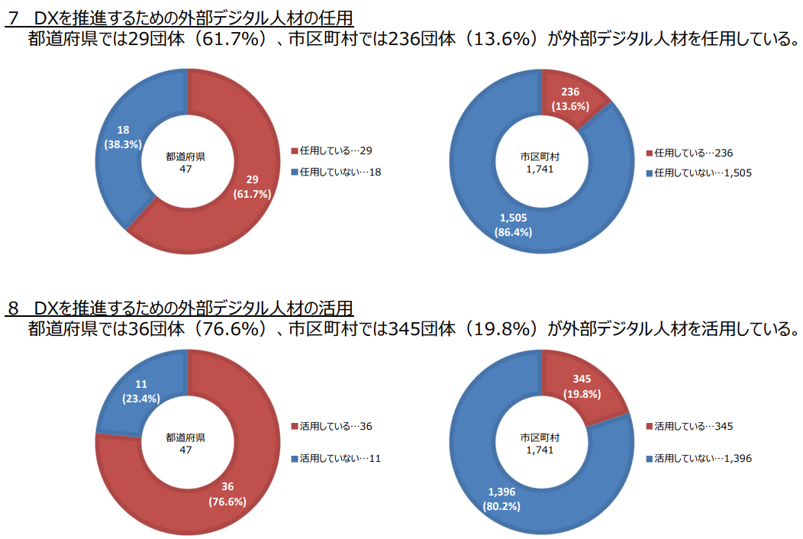

# イベントレポート

## 目次

[**１ イベント概要**](#１-イベント概要)  
[**２ イベント目的**](#２-イベント目的)  
[**３ イベント内容**](#３-イベント内容)  
[**４ 成果**](#４-成果)  
[**５ 課題**](#５-課題)  
[**６ まとめ**](#６-まとめ)  

## １ イベント概要
イベント名  
Social Hack Day #57  

開催日時  
2024年1月20日（土）10:45～18：00  

対象者：  
- オープンデータに興味がある人
- 自治体職員
- エンジニア

## ２ イベント目的
2022年度に報告した[「DataOpsを活用したオープンデータ利活用に関する報告書」](https://github.com/c-3lab/opendata-dataops-document/blob/main/README.md)におけるオープンデータ利活用プロセスやツール等の有効性の確認を目的として本イベントを開催した。  

## ３ イベント内容

今回のイベントでは、[前回のイベント](event_report_20231216.md)で議論したデータの収集蓄積プロセス及びフィードバックプロセスの有効性を確認した。

データの収集蓄積プロセスは、データ利用者がデータを有効に活用する為のデータ構造に関して継続議論した。

フィードバックプロセスは、データ提供者のモチベーションをあげる（利活用促進につなげる）ためにはどうすべきかについてデータ利用者・データ提供者それぞれの観点で議論した。

最後にデータの収集蓄積やデータの活用プロセスに使用することを想定して開発した[Assistants API UI](https://github.com/ryo-ma/gpt-assistants-api-ui)ツールのデモを実施し、意見交換を行った。

イベント内で使用したデータ、ツールについては以下に記載する。

### 使用したデータ
[緊急避妊に係る取組について｜厚生労働省](https://www.mhlw.go.jp/stf/seisakunitsuite/bunya/0000186912_00002.html)  
※ご協力いただいたプロジェクト：[アフターピル検索](https://afterpill.jp/)

### 使用したツール

* [PDF Excel 変換](https://www.ilovepdf.com/ja/pdf_to_excel)  
PDFのデータをExcel(xlsx)に変換する為のツール  

* [地方公共団体コード住所(J-LIS)](https://www.j-lis.go.jp/spd/code-address/jititai-code.html)  
郵便番号や住所から地方公共団体コードを確認する為のツール

* [Assistants API UI](https://github.com/ryo-ma/gpt-assistants-api-ui)  
OpenAI Assistants API を使用したチャットツール  
チャット機能の他にファイルのアップロードやダウンロード機能もサポートしている

* オープンデータ作成支援AI  
上記 Assistants API UI に以下を追加したツール
  - 事前情報としてデジタル庁が公開している[データ項目定義書](https://www.digital.go.jp/resources/open_data/municipal-standard-data-set-test/)を学習
  - ユーザーからの入力に応じた関数を簡単に呼び出せるようにする OpenAI の機能 [Function Calling](https://platform.openai.com/docs/guides/function-calling) を使用した、住所からGeojsonを返却する機能（デジタル庁が公開しているOSS「[abr-geocoder
](https://github.com/digital-go-jp/abr-geocoder/tree/main)」を利用）

### タイムテーブル
11:00 SocialHackDay概要説明  
11:10 全体自己紹介  
11:20 持ち込みプロジェクト全体説明  
11:40 プロジェクト毎に分室、自己紹介  
11:50 DataOpsの概念説明  
12:10 質疑応答  
12:20 お昼休憩  
13:20 再開  
13:20 前回のSocialHackDayの作業内容共有  
13:25 GIF[^1]の説明  
13:30 構造化についてのディスカッション（自由記述のようになっている営業日）  
13:45 構造化についてのディスカッション（ChatGPTの使い方）  
14:05 構造化についてのディスカッション（住所検索）  
14:10 フィードバックコメントについてのディスカッション（データ利用者側の目線、データ提供者側の目線）  
14:45 オープンデータのニーズについてのディスカッション  
15:00 前半終了、中間報告  
15:15 シャッフル  
15:20 DataOpsの概念説明  
15:30 質疑応答  
15:45 シャッフル終了、後半開始  
15:45 オープンデータ作成支援AIの説明とデモ  
17:00 成果報告会  
17:30 終了  

### オープンデータ作成支援AIの説明とデモのイメージ
オープンデータに特化したChatGPTライクなツールのオープンデータ作成支援AIを使用し、geojsonファイルの読み込みから可視化までを実施。  
オープンデータ作成支援AIデモのイメージは以下。  

## ４ 成果
イベントの中で得られた成果を以下の表にまとめた。  

<table border="1">
  <thead>
    <tr style="text-align:center">
      <th width="600px" rowspan="2">成果</th>
      <th colspan="8">関連するDataOpsプロセス</th>
    </tr>
    <tr>
      <th style="writing-mode: tb-rl;">課題抽出</th><th style="writing-mode: tb-rl;">計画</th><th style="writing-mode: tb-rl;">データの収集蓄積</th><th style="writing-mode: tb-rl;">データの公開</th><th style="writing-mode: tb-rl;">データの取得</th><th style="writing-mode: tb-rl;">データの処理</th><th style="writing-mode: tb-rl;">データの活用</th><th style="writing-mode: tb-rl;">フィードバック</th>
    </tr>
  </thead>
  <tbody>
    <tr>
      <td><strong>データをどこまで構造化するべきかはユースケースによって変わる為、ニーズに合わせて変更可能な最小限の構造（名称、住所などの共通部分のみ）であるべきことがわかった</strong></td>
      <td></td><td></td><td>○</td><td></td><td></td><td></td><td></td><td></td>
    </tr>
    <tr>
      <td>ChatGPTを使用したデータ構造のレビューやデータの可視化の体験を通して、データの構造化や検索用としてChatGPTを活用することの将来性を実感できた</td>
      <td></td><td></td><td>○</td><td>○</td><td>○</td><td></td><td></td><td></td>
    </tr>
    <tr>
      <td>オープンデータのニーズの収集は東京都職員の方がハッカソンや企業へのヒアリングを通して行っていることがわかった</td>
      <td>○</td><td></td><td></td><td></td><td></td><td></td><td></td><td>○</td>
    </tr>
    <tr>
      <td>オープンデータが循環している流れを可視化することで、さらにサイクルの加速が期待できるという意見があがった</td>
      <td></td><td></td><td></td><td></td><td></td><td></td><td>○</td><td></td>
    </tr>
    <tr>
      <td>オープンデータ作成支援AIの課題（5課題表中に記載）を把握することができた</td>
      <td></td><td></td><td>○</td><td></td><td></td><td></td><td>○</td><td></td>
    </tr>
  </tbody>
</table>

この中でも特に重要な成果は以下である。  

- データをどこまで構造化するべきかはユースケースによって変わる為、ニーズに合わせて変更可能な最小限の構造（名称、住所などの共通部分のみ）であるべきことがわかった

カスタマイズ可能な最小限の構造（名称、住所などの共通部分のみ）とすることで、ニーズにあわせたカスタマイズが可能となる。  
その為、データを加工する際はこの点を考慮しておくことが必要。  

## ５ 課題
イベントの中であがった課題を以下の表にまとめた。  

<table border="1">
  <thead>
    <tr style="text-align:center">
      <th width="600px" rowspan="2">課題</th>
      <th colspan="8">関連するDataOpsプロセス</th>
    </tr>
    <tr>
      <th style="writing-mode: tb-rl;">課題抽出</th><th style="writing-mode: tb-rl;">計画</th><th style="writing-mode: tb-rl;">データの収集蓄積</th><th style="writing-mode: tb-rl;">データの公開</th><th style="writing-mode: tb-rl;">データの取得</th><th style="writing-mode: tb-rl;">データの処理</th><th style="writing-mode: tb-rl;">データの活用</th><th style="writing-mode: tb-rl;">フィードバック</th>
    </tr>
  </thead>
  <tbody>
    <tr>
      <td>オープンデータの利用者と提供者一人一人のモチベーションをあげる仕組みが必要</td>
      <td></td><td></td><td></td><td></td><td></td><td></td><td></td><td>○</td>
    </tr>
    <tr>
      <td>データを構造化しすぎることでデータ提供者の作業コストが増加してしまう</td>
      <td></td><td></td><td>○</td><td></td><td></td><td></td><td></td><td></td>
    </tr>
    <tr>
      <td><strong>データ提供者とデータ利用者の間を仲介する（データを構造化する）ステークホルダが善循環のサイクルに存在しない</strong></td>
      <td></td><td></td><td>○</td><td></td><td></td><td></td><td></td><td></td>
    </tr>
    <tr>
      <td>オープンデータを整備する部署と公開する部署が異なる場合、フィードバックコメントを読まないことがある為、データ利用者の声がデータを整備する部署の担当者まで届かない</td>
      <td></td><td></td><td></td><td></td><td></td><td></td><td></td><td>○</td>
    </tr>
    <tr>
      <td>利用者が提供者に対して感謝の意識をもてるような仕組みが必要</td>
      <td></td><td></td><td></td><td></td><td></td><td></td><td>○</td><td>○</td>
    </tr>
    <tr>
      <td>フィードバックには報告、要望などの種類があるが、ネガティブな要素を可能な限り減らす為には「データのこの部分を修正しました」のような報告ベースのフィードバックであるべき</td>
      <td></td><td></td><td></td><td></td><td></td><td></td><td></td><td>○</td>
    </tr>
    <tr>
      <td>提供者はフィードバックとして返ってきたデータを修正する際に、責任やチェック作業にかかるコストに抵抗感を感じる恐れがある</td>
      <td></td><td></td><td>○</td><td></td><td></td><td></td><td></td><td>○</td>
    </tr>
    <tr>
      <td>DataOpsのスタートは利用者のニーズ収集から始まるため、それをサポートする仕組みが必要</td>
      <td>○</td><td></td><td></td><td></td><td></td><td></td><td></td><td>○</td>
    </tr>
    <tr>
      <td>ChatGPTを活用する上で、正しく解釈できるデータ構造とは何かについて検討する必要がある</td>
      <td></td><td></td><td>○</td><td></td><td></td><td></td><td>○</td><td></td>
    </tr>
    <tr>
      <td>欲しいデータを投票できる仕組みなど、楽にニーズを表明できる環境が必要</td>
      <td>○</td><td></td><td></td><td></td><td></td><td></td><td></td><td></td>
    </tr>
    <tr>
      <td>オープンデータ作成支援AIに検索させる場合、検索のたびにすべてのデータを参照するのは非効率である為、必要な情報に関してはある程度の構造化が必要</td>
      <td></td><td></td><td>○</td><td></td><td></td><td></td><td></td><td></td>
    </tr>
    <tr>
      <td>オープンデータ作成支援AIを使用する際、プロンプトのテクニックや処理できるデータ件数の限界を把握する必要がある</td>
      <td></td><td></td><td>○</td><td></td><td></td><td></td><td>○</td><td></td>
    </tr>
  </tbody>
</table>

この中でも特に重要な課題は以下である。  

- データ提供者とデータ利用者の間を仲介する（データを構造化する）ステークホルダが善循環のサイクルに存在しない

データ提供者に負担をかけずに利活用しやすいデータ(※1)を公開する為には、データ提供者とデータ利用者の間に、利活用しやすいデータに加工する二次データ提供者が必要だと考えられる。  

データ加工を二次データ提供者が実施することで、データ提供者の負担を軽減し、かつ利活用しやすいデータを公開することが可能になると考えられる。  

※1 利活用しやすいデータとは、機械判読(※2)可能なデータを指す。  
※2 機械判読とはコンピュータプログラムが自動的にデータを加工、編集等ができること  

以下総務省のレポート[^2]からも、自治体職員以外の人材に頼らざるを得ない状況と言える。  
 

今後の課題としては、以下の検討を進めていく必要がある。  
- 二次データ提供者によるデータ加工の自動化(データの取得 → データの加工 → データの公開)
- 二次データ提供者となりうるステークホルダの検討

## ６ まとめ

今回のイベントでは、二次データ提供者という存在が、DataOpsプロセスにおいて重要な役割を担うことがわかった。  

二次データ提供者が、利活用しやすいデータへ加工する作業コストを担うことで、データ提供者に負担をかけずに扱いやすいデータをデータ利用者が使えるようになると考えられる。  
また、データ提供者は作業コストの低減に加え、扱いやすいデータを意識することなくデータを公開することが可能になると考えられる為、データ公開に対する抵抗感をやわらげることにつながると考えられる。

この二次データ提供者の作業プロセスについては今後も検討を進めていく必要がある。  

[^1]: Digital Agency,Government of Japan, "政府相互運用性フレームワーク（GIF）" [オンライン]. Available: https://www.digital.go.jp/policies/data_strategy_government_interoperability_framework. [アクセス日: 20 02 2024].  
[^2]: 総務省⾃治⾏政局地域⼒創造グループ地域情報化企画室, “⾃治体DX・情報化推進概要,” 4 2023. [オンライン]. Available: https://www.soumu.go.jp/main_content/000878726.pdf. [アクセス日: 29 03 2024].  
