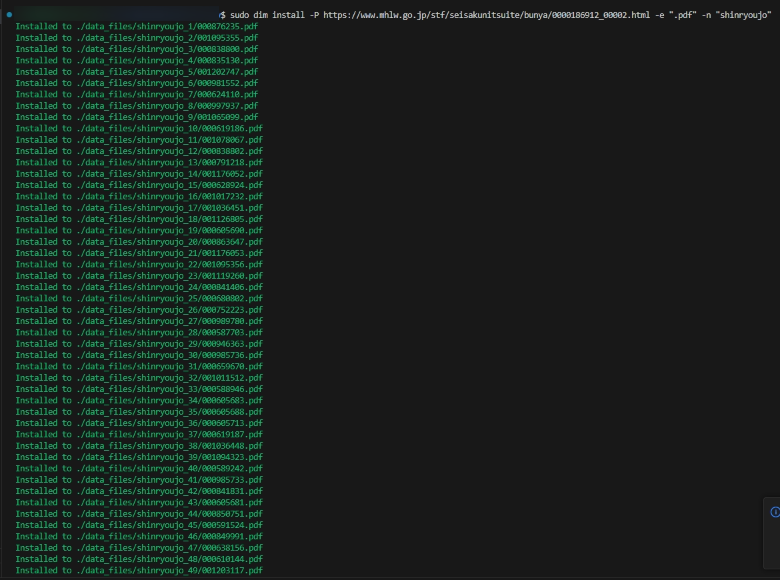
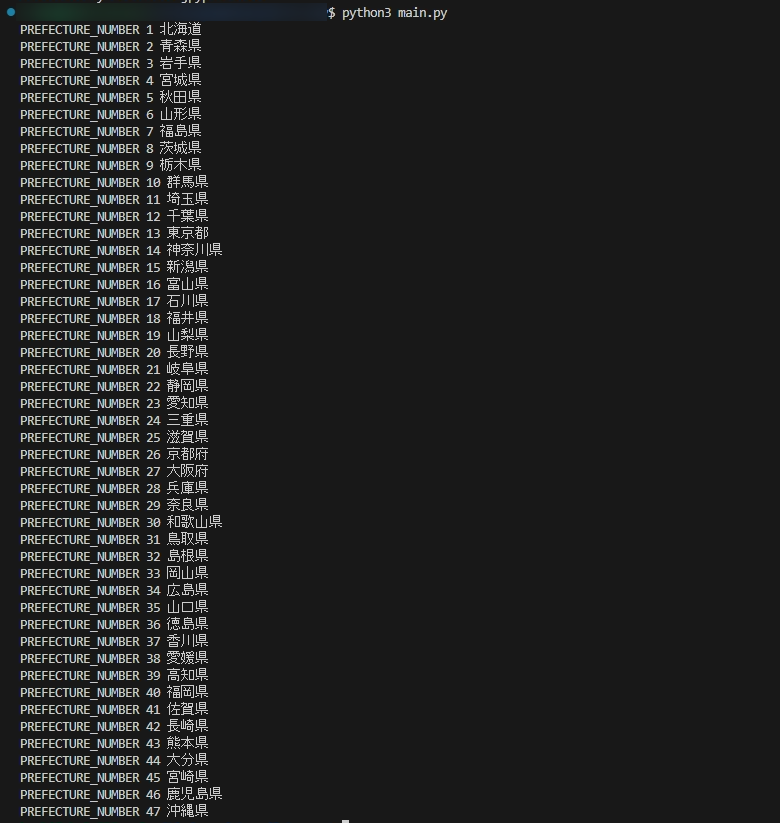
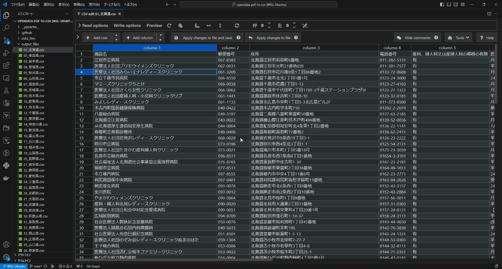

# イベントレポート

## 目次

[**１ イベント概要**](#１-イベント概要)  
[**２ イベント目的**](#２-イベント目的)  
[**３ イベント内容**](#３-イベント内容)  
[**４ アンケート結果**](#４-アンケート結果)  
[**５ 成果**](#５-成果)  
[**６ 課題**](#６-課題)  
[**７ 課題**](#７-まとめ)  

## １ イベント概要
イベント名  
Social Hack Day #58  

開催日時  
2024年2月17日（土）10:45～18：00  

対象者：  
- オープンデータに興味がある人
- 自治体職員
- エンジニア

## ２ イベント目的
2022年度に報告した[「DataOpsを活用したオープンデータ利活用に関する報告書」](../opendata_dataops_2022.md)におけるオープンデータ利活用プロセスやツール等の有効性の確認を目的として本イベントを開催した。  

## ３ イベント内容
今回のイベントでは、[前回のイベント](event_report_20240120.md)で議論した、データ提供者とデータ利用者の間を仲介する二次データ提供者の作業プロセスにフォーカスを当て、そのプロセスの一部を実際に実施した。  

二次データ提供者の作業プロセスは既存のDataOpsプロセスには存在しない為、以下を想定。  

1. 一次データ提供者(データ提供者：自治体職員など)が公開したデータを取得する（二次データ提供者によるデータ取得プロセス）
2. 取得したデータを機械判読可能なデータへ加工する  （二次データ提供者によるデータ処理プロセス）
3. データ利用者が利用できる形で提供・公開を行う（二次データ提供者によるデータ公開プロセス）
4. 一連のプロセスをCIなどで自動化する（二次データ提供者による自動化プロセス）

今回はこのうち、1、2、4の作業を実施した。  
実際の作業内容としては以下の通り。  

- 厚労省が公開している「緊急避妊薬医療機関」のPDFデータ一括取得（dimによるデータ更新管理含む）
- 取得したPDFデータのCSV変換（フォーマットが異なるPDFについても考慮）
- PDF取得からCSV変換までの GitHub Actions による自動化

イベント内で使用したデータ、ツールについては以下に記載する。

### 使用したデータ
[緊急避妊に係る取組について｜厚生労働省](https://www.mhlw.go.jp/stf/seisakunitsuite/bunya/0000186912_00002.html)  
※ご協力いただいたプロジェクト：[アフターピル検索](https://afterpill.jp/)

### 使用したツール

* [Robocorp](https://robocorp.com/)  
RPAフレームワーク、本イベントではPDFからテキストを抽出する用途で使用

* [tabula](https://tabula.technology/)  
PDFデータをCSVやExcelデータに変換するライブラリ

* [pandas](https://pandas.pydata.org/)  
Pythonのデータ解析ライブラリ

* [dim](https://github.com/c-3lab/dim)  
データインストールマネージャー  
プロジェクト内のオープン データを管理する

### タイムテーブル
11:00 SocialHackDay概要説明  
11:05 全体自己紹介  
11:10 持ち込みプロジェクト全体説明  
11:15 プロジェクト毎に分室  
11:20 DataOpsの詳細説明  
11:30 質疑・意見  
11:35 自己紹介  
11:40 厚労省公開の医療機関等一覧データのpdf_to_csv自動変換について  
11:55 休憩  
13:00 再開  
13:00 Robocorpの検証  
13:30 tabulaの検証  
13:55 リンク切れの問題について  
14:00 ~ 15:00 以下の残課題に関して分担作業  

【残課題】
- PDF to CSV
  - ヘッダーがうまく表示されていない箇所の修正  
  - ヘッダー毎に分かれてしまっている部分の修正  
- リンク切れ  
  - dimの機能でデータ更新管理(GitHub Actionsの作成)  
  - 別プロジェクトのGoogleColabで試す  

15:00 中間報告  
15:10 シャッフル  
15:15 シャッフル（質疑応答、意見）  
15:30 後半の開発タイム開始  
15:30 ~ 16:50 残課題に関して分担作業  
16:50 アンケート  
17:00 進捗・成果報告  
17:15 終了  

### PDFデータ一括取得のイメージ
dimを使用した厚労省公開の医療機関等一覧データのPDF一括取得を実施。  
PDFデータ一括取得のイメージは以下。  
  

### PDFからCSV変換時のイメージ
tabulaとpandasを使用したPDF→CSV変換を実施。  
PDFからCSV変換と、変換されたCSVのイメージは以下。  
  
  

## ４ アンケート結果
DataOpsのプロセスがオープンデータ利活用促進につながるかの根拠を得る為、イベント参加者にアンケートを実施した。  
[アンケート結果](survey/survey_20240217.md)  

## ５ 成果
イベントの中で得られた成果を以下の表にまとめた。  

<table border="1">
  <thead>
    <tr style="text-align:center">
      <th width="600px" rowspan="2">成果</th>
      <th colspan="8">関連するDataOpsプロセス</th>
    </tr>
    <tr>
      <th style="writing-mode: tb-rl;">課題抽出</th><th style="writing-mode: tb-rl;">計画</th><th style="writing-mode: tb-rl;">データの収集蓄積</th><th style="writing-mode: tb-rl;">データの公開</th><th style="writing-mode: tb-rl;">データの取得</th><th style="writing-mode: tb-rl;">データの処理</th><th style="writing-mode: tb-rl;">データの活用</th><th style="writing-mode: tb-rl;">フィードバック</th>
    </tr>
  </thead>
  <tbody>
    <tr>
      <td>tabulaとpandasを用いたPDF→CSV変換で、改行コードを置換することで変換することに成功した</td>
      <td></td><td></td><td></td><td></td><td></td><td>○</td><td></td><td></td>
    </tr>
    <tr>
      <td>dimの機能を活用して、PDFを取得することに成功した</td>
      <td></td><td></td><td></td><td></td><td>○</td><td></td><td></td><td></td>
    </tr>
    <tr>
      <td><strong>CIによって定期的（1日1回）にPDFを一括ダウンロードし、CSVに自動変換するツールが完成した</strong></td>
      <td></td><td></td><td></td><td></td><td>○</td><td>○</td><td></td><td></td>
    </tr>
  </tbody>
</table>

この中でも特に重要な成果は以下である。  

- CIによって定期的（1日1回）にPDFを一括ダウンロードし、CSVに自動変換するツールが完成した

二次データ提供者によるデータの取得（PDF）から機械判読可能なデータ（CSV）に変換するまでの処理を自動化することに成功した。([opendata-pdf-to-csv](https://github.com/c-3lab/opendata-pdf-to-csv))  

後述の「課題」にも記載されている通り、いくつか課題が残っている為、今後も検討を進める必要がある。  

## ６ 課題
イベントの中であがった課題を以下の表にまとめた。  

<table border="1">
  <thead>
    <tr style="text-align:center">
      <th width="600px" rowspan="2">課題</th>
      <th colspan="8">関連するDataOpsプロセス</th>
    </tr>
    <tr>
      <th style="writing-mode: tb-rl;">課題抽出</th><th style="writing-mode: tb-rl;">計画</th><th style="writing-mode: tb-rl;">データの収集蓄積</th><th style="writing-mode: tb-rl;">データの公開</th><th style="writing-mode: tb-rl;">データの取得</th><th style="writing-mode: tb-rl;">データの処理</th><th style="writing-mode: tb-rl;">データの活用</th><th style="writing-mode: tb-rl;">フィードバック</th>
    </tr>
  </thead>
  <tbody>
    <tr>
      <td>オープンデータとして公開されているPDFが定期的に更新され、リンク切れが発生してしまう → dimによるデータ更新管理で対応</td>
      <td></td><td></td><td></td><td></td><td>○</td><td></td><td></td><td></td>
    </tr>
    <tr>
      <td>リンク切れの判別は、PDFをダウンロードして確認するか、サイトの最終更新で確認するしかない → dimによるデータ更新管理で対応</td>
      <td></td><td></td><td></td><td></td><td>○</td><td></td><td></td><td></td>
    </tr>
    <tr>
      <td>dimによるPDF取得時に2ファイルほど関係のないファイルが混ざっている</td>
      <td></td><td></td><td></td><td></td><td>○</td><td></td><td></td><td></td>
    </tr>
    <tr>
      <td>PDFを一括ダウンロードして、csvのような機械可読性の高いものに自動変換したい → イベント内で作成完了</td>
      <td></td><td></td><td></td><td></td><td>○</td><td>○</td><td></td><td></td>
    </tr>
    <tr>
      <td>Robocorpを使用したPDF→CSV変換ではPDF内のテーブルが認識されずテキストとして出力されてしまう</td>
      <td></td><td></td><td></td><td></td><td></td><td>○</td><td></td><td></td>
    </tr>
    <tr>
      <td>tabulaとpandasを用いたPDF→CSV変換を行う際、以下の課題を確認 ● 変換後、出力されたCSVがPDFのページ毎にわかれてしまう → イベント内で対応済 ● PDFのヘッダーが毎回記述されてわかりにくい</td>
      <td></td><td></td><td></td><td></td><td></td><td>○</td><td></td><td></td>
    </tr>
    <tr>
      <td>各都道府県によってフォーマットの差異がある（１ページ目だけにヘッダーが記載されている、独自の列があるなど）</td>
      <td></td><td></td><td></td><td></td><td></td><td>○</td><td></td><td></td>
    </tr>
    <tr>
      <td>データが公開されているページにPDFの追加や順番の入れ替わり等が発生するとPDFの更新取得処理に失敗する可能性がある → CIが落ちることで検知可能</td>
      <td></td><td></td><td></td><td></td><td>○</td><td></td><td></td><td></td>
    </tr>
    <tr>
      <td><strong>今回のPDF→CSV変換処理は、幅広い分野のオープンデータに対しても検証を進めた方がいい</strong></td>
      <td></td><td></td><td></td><td></td><td></td><td>○</td><td></td><td></td>
    </tr>
  </tbody>
</table>

この中でも特に重要な課題は以下である。  

- 今回のPDF→CSV変換処理は、幅広い分野のオープンデータに対しても検証を進めた方がいい

今回のイベントでは、厚労省が公開している「緊急避妊薬医療機関」のPDFデータにて検証を進めたが、他のオープンデータに関しても同様の問題が発生する可能性がある為、引き続き幅広いオープンデータの検証を進める必要がある。  

## ７ まとめ

今回のイベントでは、データ提供者とデータ利用者の間を仲介する二次データ提供者の作業プロセスにフォーカスを当て、PDFデータの取得からPDF→CSVへの変換処理までの自動化に成功した。  

動くものは完成したものの、[6 課題](#６-課題)にも記載している問題もある為、今後も検討を進めていく必要がある。