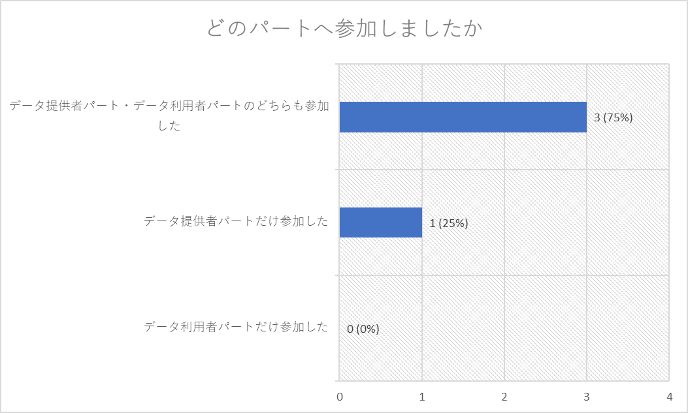
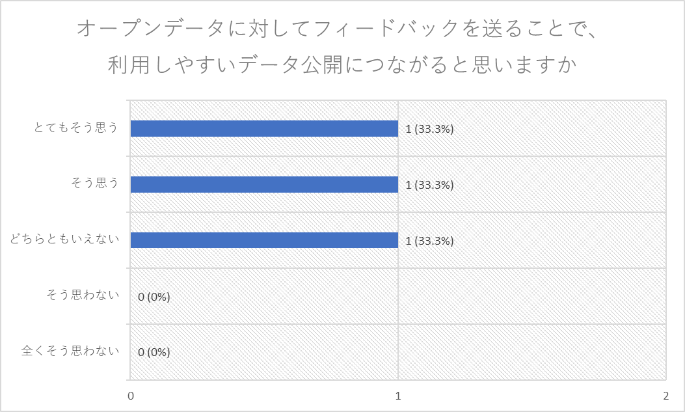

# アンケート結果

## アンケート実施日
2023年12月16日（土）

## アンケート集計

---

---

---

---
### 上記設問の選択肢を選ばれた理由を教えてください
- とてもそう思う
  - フィードバックを返すことはDataOpsにとって必須だと思うから
  - 個別データに対してのフィードバックは必要と感じていたため
  - 利用者の問題点を把握しやすい為
- そう思う
  - データの改善にフィードバックは必要
---

---
### 上記設問の選択肢を選ばれた理由を教えてください
- とてもそう思う
  - データが正規化されていることの重要性を感じることができた
- どちらともいえない
  - 処理のしにくさはあるものの重要だと思う
  - 利用者の求めるものに十分なっていない
  - 公開していない為
---
### データ提供者パートを体験してみて感じたことを教えてください
- データの入り口の部分でデータを綺麗にしておかないと大変だと思った
- ChatGPTの可能性を感じることができた
- データ利用者の気持ちを理解する必要がある
- データ提供には、多大な労力が必要であり、作成に関わる人には善意を持って対応していただける人もいる  
ただ、フォーマット等、データを処理する上で必要な最低限の知識の共有が行われていないことが課題として考えられ、この課題が解決すれば良いなと感じている
---

---
### 上記設問の選択肢を選ばれた理由を教えてください
- とてもそう思う
  - データの過不足について、提供者に伝えることができるのは意義がある
- そう思う
  - フィードバックを反映してくれる体制づくりも大事だと思う
- どちらともいえない
  - フィードバックを活かそうという提供者側のマインド、文化またはモチベーションが条件になる
---

---
### 上記設問の選択肢を選ばれた理由を教えてください
- とてもそう思う
  - 修正されるまでのスピードにもよりますが、フィードバックが反映されることで利用しやすくなると感じた
- そう思う
  - 表記揺れを修正しただけで扱いやすくなる
  - 修正されたため
---
### データ利用者パートを体験してみて感じたことを教えてください
- 表記揺れを修正しただけで扱いやすくなる
- ChatGPTに命令を送ることで可視化がスムーズにできた
- 使いたいデータ、使えるデータがほしい
---
### 生成系AIをオープンデータ分野に活用するとどのような利点があると思いますか
- 誰でもデータを扱えるようになるのでいいと思う
- 簡単な命令で可視化ができたりするので、データの確認などに使える可能性がある
- 今日やったようにデータの質をチェックして指摘してくれる
- フォーマットから外れたデータの修正、入力の補助に活用するとより使いやすいデータが作成しやすい利点があると思う
---
### 生成系AIをオープンデータ分野で活用していくにはどのような課題があると思いますか
- 表記揺れや日本固有のデータのクセなどを学習しておくといいと思った
- データが正しいかどうかの判別が難しい
- 学習に使うならデータの質が問題になる
- 一般化されていないこと、金銭的コストがかかることが課題であると思う
---
### 本イベントで扱ったオープンデータをより使いやすいものにするためにイベント内で出た修正案以外に改善できそうな点があればお教えください
- 緯度経度の取り方を工夫していく必要があると感じた
- 人力でやっているところが何％なのかを明らかにすることも必要だと感じた
- 営業日時曜日データの標準化
- フォーマットの統一（特に、入力値の形が一意に定まるようなものが望ましい）
---
### オープンデータとして公開してほしい・公開していたらいいなというデータがあれば教えてください
- ふるさと納税のデータ、標準化がすすめば住民情報（統計情報）
- 行政機関が持っている全データの一覧情報（オープン化されているデータカタログの他にも面白いデータがたくさんあるはずなので）
---

