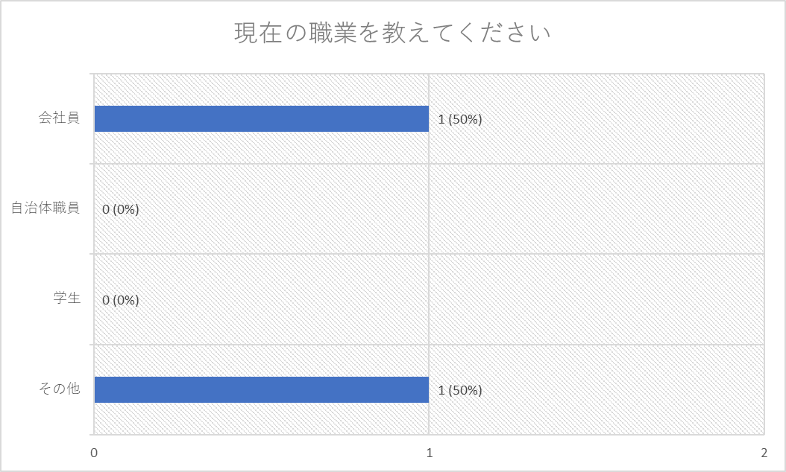
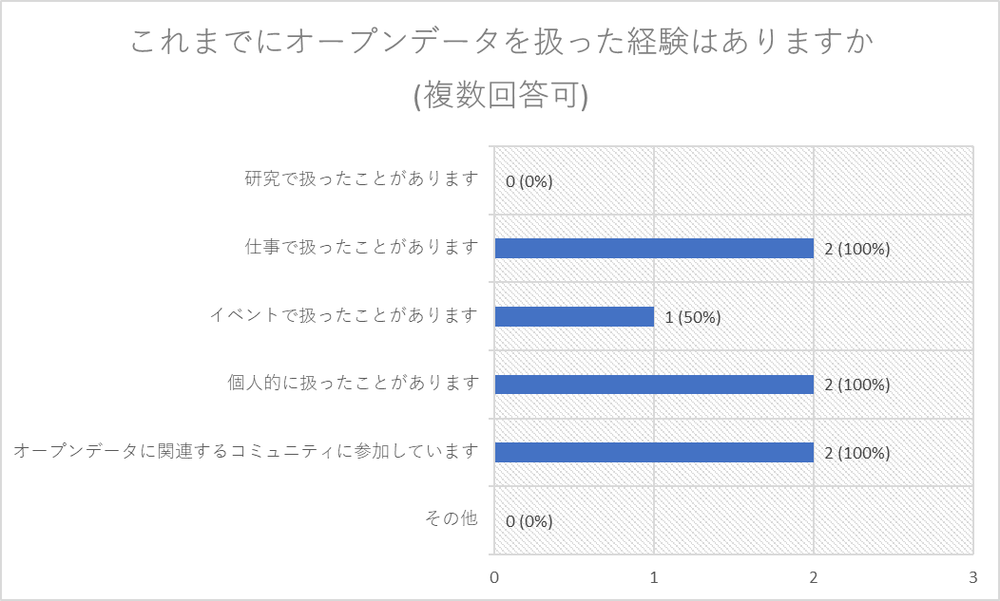
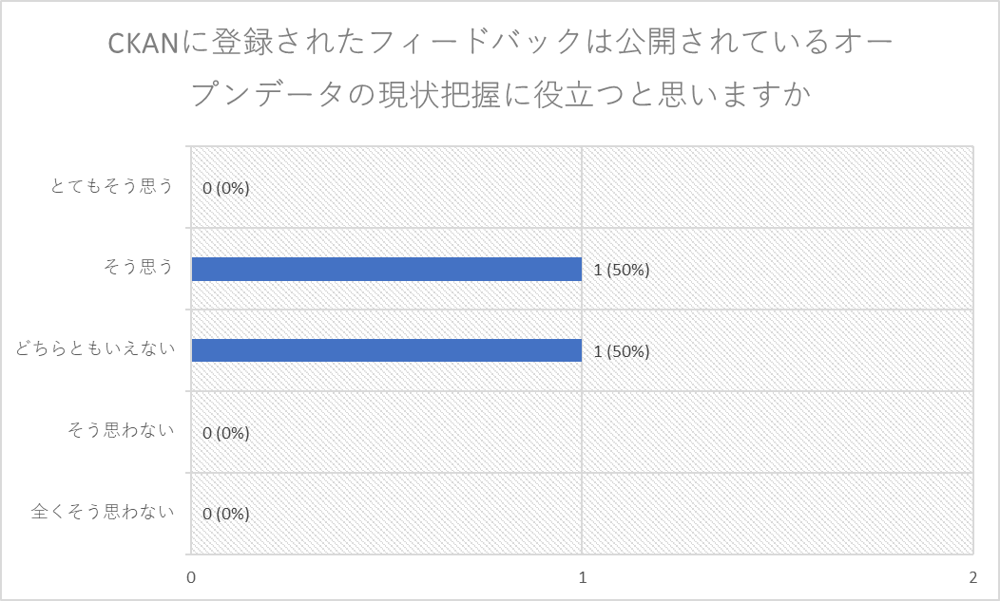
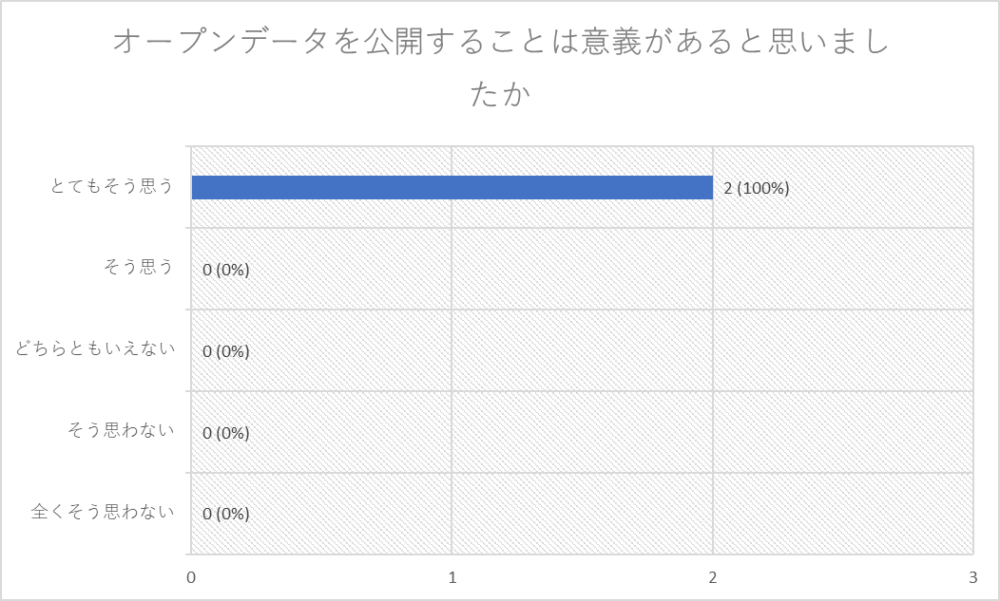
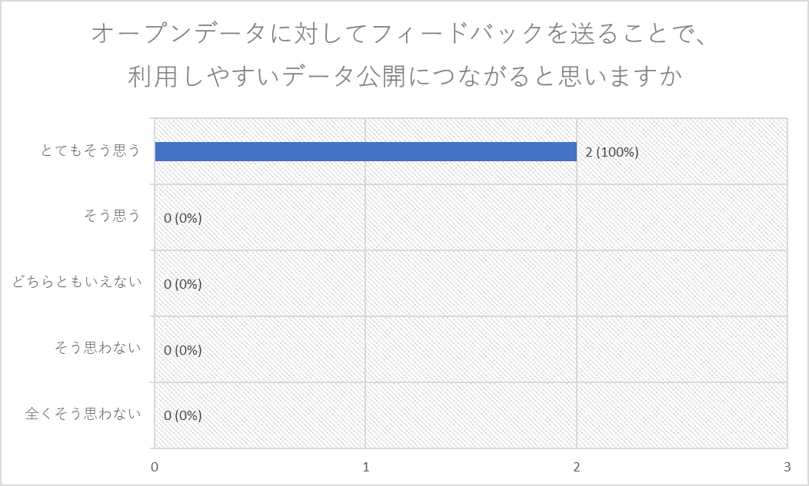
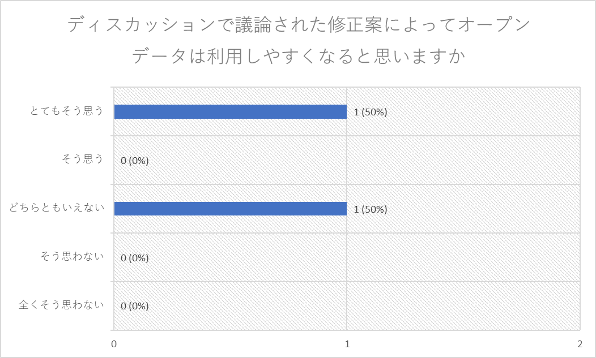

# アンケート結果

## アンケート実施日
2024年2月17日（土）

## アンケート集計

---

---

---
### 上記設問の選択肢を選ばれた理由を教えてください
- そう思う
  - オープンデータの公開者は猛烈にフィードバックを欲していると思うが、量・質ともに十分な数が集まるかどうかは若干疑問
- どちらともいえない
  - 使っていない
---

---
### 上記設問の選択肢を選ばれた理由を教えてください
- とてもそう思う
  - データはオープンになって当たり前の世界にならなければ
  - 税金で調べたデータであれば、利用しやすい形で公開すべきだし、より一般の人の利活用でデータの意義も増えると思う
---

---
### 上記設問の選択肢を選ばれた理由を教えてください
- とてもそう思う
  - こういうのに敏感な人は多いと思う
  - 使いにくい形のデータ公開が多い
---

---
### 上記設問の選択肢を選ばれた理由を教えてください
- とてもそう思う
  - 一人が声を上げるよりもより通りやすくなると思います
- どちらともいえない
  - フィードバックの取捨選択ができるのかが疑問
---
### 本イベントを通して、感じたことを教えてください
- 楽しかったです
---
### 生成系AIをオープンデータ分野に活用するとどのような利点があると思いますか
- 大量のデータから意味を抽出できる
- データの形式変換がより簡単になる
---
### 生成系AIをオープンデータ分野で活用していくにはどのような課題があると思いますか
- データの数値が変わってしまう可能性
---
### 本イベントで扱ったオープンデータをより使いやすいものにするためにイベント内で出た修正案以外に改善できそうな点があればお教えください
- 回答なし
---
### オープンデータとして公開してほしい・公開していたらいいなというデータがあれば教えてください
- 酒蔵、日本酒のオープンデータ
---
