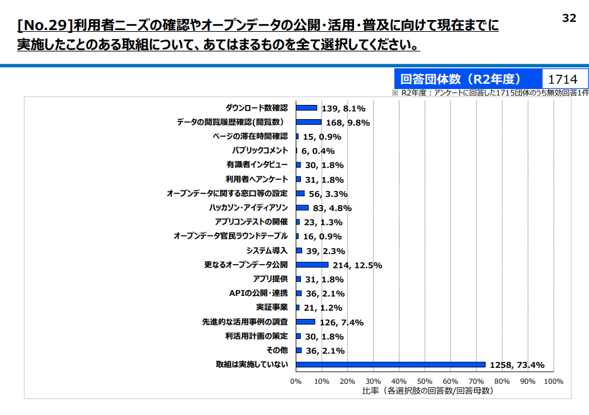
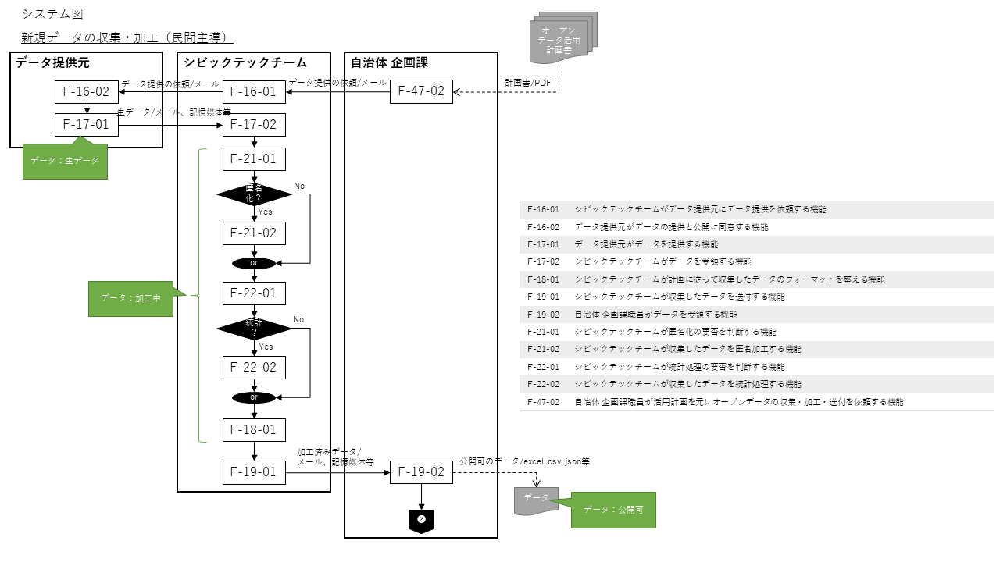
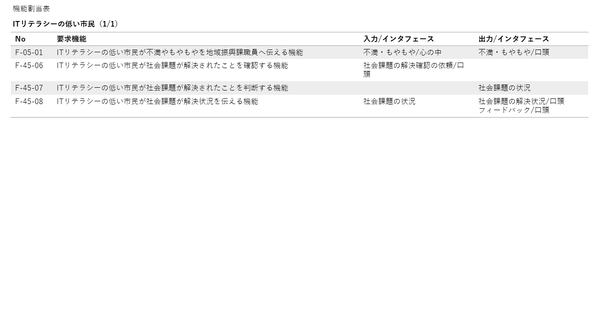

DataOpsを活用したオープンデータ利活用に関する報告書

Ver 0.9
2022年09月30日

c-3lab

　By c-3lab

このドキュメントの内容物は [クリエイティブ・コモンズ 表示 4.0 ライセンス \[1\]の下に提供されています。](http://creativecommons.org/licenses/by/4.0/deed.ja)

# 目次

[目次](#目次)  
[１ はじめに](#はじめに)  
[１-１ 本報告書の位置づけ](#本報告書の位置づけ)  
[１-２ 背景](#背景)  
[１-３ オープンデータの利活用を阻害する要因](#オープンデータの利活用を阻害する要因)  
[１-３-１ 必要なデータが探しづらい](#必要なデータが探しづらい)  
[１-３-２ 必要なデータが公開されていない](#必要なデータが公開されていない)  
[１-３-３ オープンデータの認知度が低い](#オープンデータの認知度が低い)  
[１-３-４ 利用者のニーズが解らない](#利用者のニーズが解らない)  
[２ DataOpsとは](#dataopsとは)  
[３ オープンデータのDataOps](#オープンデータのdataops)  
[３-１ オープンデータ利活用のDataOpsによる改善](#オープンデータ利活用のdataopsによる改善)  
[４ ステークホルダの分析](#ステークホルダの分析)  
[４-１ ステークホルダの分析](#ステークホルダの分析)  
[４-１-１ データ利用者](#データ利用者)  
[４-１-２ データ提供者](#データ提供者)  
[４-１-３ システム](#システム)  
[４-２ 本報告書で分析する範囲](#本報告書で分析する範囲)  
[４-３ 考慮すべきポイント](#考慮すべきポイント)  
[５ ユースケースの分析](#ユースケースの分析)  
[５-１ 代表的なユースケース](#代表的なユースケース)  
[５-１-１ 課題を抽出する](#課題を抽出する)  
[５-１-２ オープンデータの活用計画を立案する](#オープンデータの活用計画を立案する)  
[５-１-３ データを収集・加工し蓄積する](#データを収集加工し蓄積する)  
[５-１-４ データを公開する](#データを公開する)  
[５-１-５ オープンデータを取得し処理をする](#オープンデータを取得し処理をする)  
[５-１-６ オープンデータを活用し課題を解決する](#オープンデータを活用し課題を解決する)  
[５-１-７ オープンデータの利用状況をフィードバックする](#オープンデータの利用状況をフィードバックする)  
[５-２ 考慮すべきポイント](#考慮すべきポイント)  
[６ 状態遷移の分析](#状態遷移の分析)  
[６-１ 状態遷移の詳細](#状態遷移の詳細)  
[７ 業務フローの分析](#業務フローの分析)  
[７-１ 業務フローの詳細化](#業務フローの詳細化)  
[７-１-１ 課題を共有する](#課題を共有する)  
[７-１-２ オープンデータの活用計画を立案する](#オープンデータの活用計画を立案する)  
[７-１-３ データを収集・加工し蓄積する](#データを収集加工し蓄積する)  
[７-１-４ データを公開する](#データを公開する)  
[７-１-５ オープンデータを取得する](#オープンデータを取得する)  
[７-１-６ オープンデータを活用し課題を解決する](#オープンデータを活用し課題を解決する)  
[７-１-７ オープンデータの利用状況をフィードバックする](#オープンデータの利用状況をフィードバックする)  
[７-２ ステークホルダの詳細化](#ステークホルダの詳細化)  
[７-３ オープンデータの善循環に関わる主な役割](#オープンデータの善循環に関わる主な役割)  
[７-３-１ データ利用者](#データ利用者)  
[７-３-２ データ提供者](#データ提供者)  
[７-３-３ システム](#システム)  
[７-３-４ データ提供元](#データ提供元)  
[７-３-５ 課題のウォッチャー](#課題のウォッチャー)  
[７-４ 考慮すべきポイント](#考慮すべきポイント)  
[８ ITシステムや人的な運用等で対応すべきポイントへの提言](#itシステムや人的な運用等で対応すべきポイントへの提言)  
[８-１ 地域の課題を抽出するフェーズ](#地域の課題を抽出するフェーズ)  
[８-２ オープンデータの活用計画を立案するフェーズ](#オープンデータの活用計画を立案するフェーズ)  
[８-３ データを収集・加工し蓄積するフェーズ](#データを収集加工し蓄積するフェーズ)  
[８-４ データ公開フェーズ](#データ公開フェーズ)  
[８-５ リアルタイムデータを収集・加工し公開するフェーズ](#リアルタイムデータを収集加工し公開するフェーズ)  
[８-６ オープンデータを取得するフェーズ](#オープンデータを取得するフェーズ)  
[８-７ オープンデータを活用し課題を解決するフェーズ](#オープンデータを活用し課題を解決するフェーズ)  
[８-８ オープンデータの利用状況をフィードバックするフェーズ](#オープンデータの利用状況をフィードバックするフェーズ)  
[９ まとめ](#まとめ)  
[１０ 参照文献](#参照文献)  
[１１ 付録](#付録)  
[１１-１ ステークホルダの機能](#ステークホルダの機能)  
[１１-１-１ 自治体 企画課](#自治体-企画課)  
[１１-１-２ 自治体 地域振興課](#自治体-地域振興課)  
[１１-１-３ 自治体 統計課などの原局](#自治体-統計課などの原局)  
[１１-１-４ 地場の企業](#地場の企業)  
[１１-１-５ ITリテラシーの高い市民](#itリテラシーの高い市民)  
[１１-１-６ ITリテラシーの低い市民](#itリテラシーの低い市民)  
[１１-１-７ シビックテックチーム](#シビックテックチーム)  
[１１-１-８ データ提供元](#データ提供元)  
[１１-１-９ ウォッチャー](#ウォッチャー)  
[１１-１-１０ シビックハッカー](#シビックハッカー)  
[１１-１-１１ オープンデータを利用したソフトウェア](#オープンデータを利用したソフトウェア)  
[１１-１-１２ 社会課題共有システム](#社会課題共有システム)  
[１１-１-１３ データ横断検索システム](#データ横断検索システム)  
[１１-１-１４ データ公開システム](#データ公開システム)  
****

# はじめに

## 本報告書の位置づけ

本報告書は、オープンデータの公開自体は増加しているが実際の利活用は進んでいないという現状を踏まえ、オープンデータの提供者と利用者が一体となって意思疎通を密にし、お互いの活動内容を意識しあうことでオープンデータの利活用が促進されるというオープンデータ利活用プロセスやツール等について提案する。ただし本報告書で提案するプロセスは典型的な状況を想定して議論しているため、適用する場合は実際の状況に応じて適時変更する必要があることに留意して欲しい。

## 背景

オープンデータが利活用されない事実は下記の*オープンデータ*の取り組みや、*オープンデータを活用した事例により読み取れる。
*令和4年6月28日時点でのオープンデータに取り組む地方公共団体の割合は約71%になる*。[2]

**一方、上のグラフとは年度が異なるが、令和3年6月9日公開の下の地方公共団体へのオープンデータの取組に関するアンケート結果（以下、アンケート結果） [3]では、約**4****6***%**の団体が**オープンデータを活用****し****た事例はまだないと回答している。

オープンデータの取り組みをしている団体は多いものの、オープンデータを活用しているという事例は半数近くの団体で確認されていない。

これらよりオープンデータの利活用を阻害する要因があるのではないかと考え、「必要なタイミングで信頼できるデータや分析結果が入手可能で、データの利用者と提供者とが協調してプロセス、ツール環境や組織文化を継続的に改善するもの」という**DataOps**の概念を利用し、オープンデータが利活用され、社会の課題が解決されるという一連の流れがうまく回るようにすることを目的とする。

## オープンデータの利活用を阻害する要因

アンケート結果 [3]よりオープンデータの利活用を阻害する要因を抜き出すと、「**必要なデータが探しづらい**」「**必要なデータが公開されていない**」「**オープンデータの認知度が低い**」「**利用者のニーズが解らない**」などがあり、その4項目のオープンデータ利活用を阻害する要因の根拠を記載する。

### 必要なデータが探しづらい

蓄積されたデータをいかにして活用するかという点において、アンケート結果 [3]の中で、公開先については自治体公式HPが約33%あるなか、その他、都道府県、民間事業者、中央省庁所管 サイト、広域連携サイトと公開方法にばらつきがあり、利用者から見ると、**どこに****必要なデータがあるのか****探しにくい** **[4]という意見がある。

アンケート結果 [3]の中で、域内での市区町村を巻きこんだ取組は予定していないが約80％と非常に高いことより、利用者が欲しいデータが**団体****別****に****バラバラに管理さ****れデータがみつけづらいと考えられる。

### 必要なデータが公開されていない

背景にて説明した約46％がオープンデータを活用した事例はまだないという回答や、オープンデータとして公開されているファイル数についてのアンケート結果 [3]では約26％がオープンデータを公開しているがファイル数が10以下となっているなどから、蓄積されたデータをいかにして活用するかという点においてデータ量が少なく、欲しいデータ、必要なデータが公開されていない可能性がある。弊社が自治体にヒアリングした中でも欲しい**データが公開されていない**いうところが課題設定されている自治体があることを認識している。

### オープンデータの認知度が低い

アンケート結果 [3]の中でオープンデータについて約94%は知ってはいるが、アンケート結果のうち約40%は詳細が分かっていないと回答している。約40%がオープンデータの重要性について 理解していないと考えられる。

さらに、他のアンケート結果 [3]の中でもオープンデータの研修会等に参加していないが約**46%**と非常に高いことにより、オープンデータを提供する側のオープンデータの認知度が低い こともあり、今後**認知度を上げる必要**がある。

また、このような状況の中で**市民は、オープンデータについて認知していない**のではないかと考えられる。

### 利用者のニーズが解らない

アンケート結果 [3]の中で、約51%がオープンデータの効果・メリット・ニーズが不明確と回答しているにもかかわらず、利用者ニーズの確認やオープンデータの公開・活用・普及に向けて 現在までに**実施したことのある取組がない**と約73%が回答。

オープンデータの提供者とその利用者が一体となってデータを利活用し課題を解決する必要があるが、**利用者ニーズが不明**のままとなっている。利用者からのフィードバックが不明のため、オープンデータは公開されているが、本当に必要なオープンデータが公開されていない、利活用されていないのではないかと仮定する。

# DataOpsとは

ガートナー社の定義 [5]によれば、DataOpsとは「組織全体のデータ管理者とデータ利用者の間のコミュニケーションの向上と、データフローの統合と自動化の改善に焦点を当てた共同作業 によるデータ管理の手法」と説明している。
DataOpsの概念を利用することで、利用者が、必要なタイミングで信頼できるデータや分析結果を入手可能となり、データの利用者と提供者とが協調してプロセス、ツール環境や組織文化の 継続的な改善が期待できる。
オープンデータの取り組みにおいて、蓄積されたデータをいかにして活用するかが重要な課題となっており、対策としてオープンデータの提供者とその利用者が一体となってデータを利活用し課題を解決する取り組みや、オープンデータを公開するデータ連携基盤自体を維持管理する仕組みが必要となる。

また、「データを活用し業務を改善する」「データ活用で得られた価値や知見をフィードバックしてデータを改善する」というサイクルを、関係する部門と担当者全員が協働しながら高速かつ高品質に回していくことが重要になる。

# オープンデータのDataOps

## オープンデータ利活用のDataOpsによる改善

1-2 背景で示したように、オープンデータの利活用を阻害する要因として「**必要なデータが探しづらい**」「**必要なデータが公開されていない**」「**オープンデータの認知度が低い**」「**利用者のニーズが解らない**」といった様々な問題が挙げられている。それらの問題には、オープンデータの提供者と利用者が一体となって意思疎通を密にし、お互いの活動内容を意識しあうことで解消を図ることができる問題も多いと考えられる。その改善策の一例を下表に記載する。
|                            |                                                                                                                                                                                                                                              |
|----------------------------|----------------------------------------------------------------------------------------------------------------------------------------------------------------------------------------------------------------------------------------------|
|問題                        |改善策                                                                                                                                                                                                                                        |
|オープンデータが見つけづらい|オープンデータが様々な場所にあるためにデータ利用者は目的のオープンデータを見つけずらい、データ提供者側でオープンデータを横断して検索できる仕組みに登録することにより改善されるのではないか                                                    |
|欲しい情報が無い            |データ利用者からのフィードバックが不明確なため、フィードバックを取得する仕組み、課題を共有する仕組みがあれば、データを提供する側では欲しい情報がわかり、データを利用する側では欲しい情報が手に入り改善されるのではないか                      |
|認知度が低い                |地域独自の魅力の活用に向けてオープンデータ伝道師を市区町村に派遣する取組がありデータ提供者側の認知度は高くなりつつあるが、地場の企業やデータ利用者である市民にもオープンデータ伝道師のような有識者を派遣することにより、改善されるのではないか|
|利用者のニーズが不明確      |データ利用者のニーズが不明確なため、データ利用者、データ提供者の間で課題（ニーズ）を共有する仕組みがあれば改善されるのではないか                                                                                                              |

このような仮説を踏まえ、本報告書ではオープンデータの善循環によるオープンデータの利活用促進を提案する。

これはDataOpsの概念をもとに、オープンデータを取り巻くステークホルダやそれらのプロセスを整理し、それぞれのWillとMustをつなげて円環と成し関係者間の連 携を図ることで、オープンデータの利活用を促進させる取り組みである。

以降の章では、提案するオープンデータの善循環のあらましを、ステークホルダやユースケースの分析から言語化・図示化し、オープンデータを利活用する上で誰がどのような役割を果たすべきなのか、その際に考慮すべき事項は何なのかを業務フローの観点から分析する。
そしてそれらの分析を踏まえ、オープンデータを利活用するために備えるべきシステムやツール、ドキュメント等について提言する。

# ステークホルダの分析

オープンデータを循環させる為のステークホルダを明らかにする。関係している人や組織、お互いどんな関連性を持っているか、どんな情報のやり取りをしているかという視点より分析する。下図より「**データ利用者**」「**データ提供者**」「**システム**」の観点からステークホルダをピックアップする。

## ステークホルダの分析

### データ利用者

市民
オープンデータを活用した**課題を解決する****仕組みを****利用する人**。悩みや不安といった課題を言語化しシステムへ登録する。→システムが使えない市民はどのようにするか。

シビックハッカー
市民からの課題を解決する為、オープンデータを利用して**アプリやサービスを開発する市民**。→課題を解決するためのオープンデータを、どのようにして探し出すか。

### データ提供者

自治体
**オープン****データ****の提供者**。市民や地場の企業よりデータを収集し登録、更新、削除を行う。メタデータや検索インデックスの作成、オープンデータの利用状況の把握を行う。中央省庁へオープンデータの利活用状況の報告を行う、及び指示を受ける。
地場の企業
**データ****の****提供者**。→企業側から提供するメリットやセキュリティーの観点からデータ提供の難しさがあると考えられる。

### システム

オープンデータ
二次利用が可能なルールで公開された無償データ。
検索インデックス
シビックハッカーなどが、必要とするオープンデータを効率的に探し出すために、組織ごとに存在するデータを検索するシステム。
メタデータ
システムの検索対象となるデータを要約したデータ。オープンデータでは自治体がデータに付与するデータに関する情報を記したデータ。

## 本報告書で分析する範囲

オープンデータの利活用の中心となるプロセスは、社会の課題を抽出し、それらを踏まえてデータの収取・公開活動を計画・実践し、公開されたデータを活用して社会の課題を解決して結果や要望をフィードバックする、という一連の流れとなり、本報告書ではその主要な一連のプロセスについて分析を行っている。
しかし実際にオープンデータ利活用を促進するためには、データ提供者への金銭的（あるいは別の形での）インセンティブの取り扱いやそれに伴う契約面の議論、プライバシーへの配慮、あるいは実際に課題を解決するサービスそのものや、その運用プロセスなども検討しなければならない。
本報告書では、主要なプロセスの分析に焦点をあてるために、それらの追加の議論は範囲外としていることにご留意頂きたい。

## 考慮すべきポイント

ステークホルダの分析から見えてきた、本報告書の内容を実際の現場に適用する際に考慮すべきポイントを下記に記載します。
また、他にも考慮すべきポイントがあるかもしれませんので、ご留意ください。
|  |                                                                                                                                                                                              |                    |                                                                                                    |
|--|----------------------------------------------------------------------------------------------------------------------------------------------------------------------------------------------|--------------------|----------------------------------------------------------------------------------------------------|
|No|内容                                                                                                                                                                                          |ステークホルダ      |考慮すべきポイント                                                                                  |
|1 |自治体から市民への課題の取得方法には下記があると考えられる。  1. システムに入力された課題を取得  2. 自治体職員が直接ヒアリング                                                                |自治体職員市民      |課題の取得方法はこれでよいかこれ以外にはないか                                                      |
|2 |直接自治体が、地場の企業へデータ提供の依頼を行うと考えられる                                                                                                                                  |自治体職員地場の企業|どのようにして、地場の企業からデータを提供していただくか地場の企業へのメリットの提供が必要ではないか|
|3 |自治体の仕事は下記があると考えられる  1. 利活用状況の把握  2. データの収集、加工  3. データの登録、更新、削除  4. メタデータの登録、更新、削除  5. 検索インデックスの 登録  6. 利活用状況の報告|自治体自治体職員    |自治体の仕事はこれ以外にないか自治体職員に負荷のかからないようなシステムやツールはないか            |
|4 |オープンデータの検索項目は下記があると考えられる  1. データセットのタイトル  2. データセットの説明  3. データセットのタグ                                                                     |シビックハッカー    |シビックハッカーが検索する検索項目はこれて足りているか。足りない場合どのような検索項目が必要か      |

****

# ユースケースの分析

## 代表的なユースケース

オープンデータの利活用の中心となる一連の処理の流れを念頭に書き出した代表的なユースケースを下図に記載し、内容を詳細に分析する。

### 課題を抽出する

利活用状況のフィードバックを抽出する。オープンデータの利活用状況のフィードバックや地域の課題が登録されていることが事前の条件となり、最終的にフィードバックが見える化され課題が抽出されること。

個別に適用すべき際に検討すべき事項

* 自治体は課題をどのように抽出しているか。
* 問題や不満をシステムに登録できない市民は、どのようにして課題を伝えているか。

### オープンデータの活用計画を立案する

その地域で公開し活用すべきオープンデータの活用計画を立案する。前提条件は下記の３つとなる。

* 解決すべき地域の課題が見える化されている。
* 公開済みのオープンデータの利活用状況が見える化されている。
* GIF [6]等の公開すべきオープンデータの種別を中央省庁などがリスト化している。

最終的に活用すべき個々のオープンデータの利活用計画が立案されること。

個別に適用すべき際に検討すべき事項

* 課題の重複、解決済みの場合は課題を破棄してもよいか。
* 企画立案に役立つ地域の課題を共有するシステムが必要なのではないか。

### データを収集・加工し蓄積する

公開すべきデータを収集し、公開可能な形式・内容へ加工して、データ公開システムに蓄積する。
前提条件は下記の2つとなる。

* 公開すべきオープンデータの収集手順とフォーマットが確定していること。
* データ公開システムへデータの蓄積が可能となっていること。

最終的に公開すべきデータがデータ公開システムに蓄積されること。

個別に適用すべき際に検討すべき事項

* オープンデータの収集頻度はどのくらいか。

自治体は市民や企業以外から他の手段で収集済みのデータを匿名加工あるいは統計処理し定められたフォーマットに加工し、システムへ登録するユースケースも存在する。
※データ公開システム自体が存在し自治体が利用可能となっていることを前提条件とし、今回の分析の範囲外とする。

### データを公開する

データ公開システムに蓄積したデータを公開する。
前提条件は下記の3つとなる。

* 公開すべきデータがデータ公開システムに蓄積されていること。
* 公開すべきオープンデータのメタデータ項目が定められていること
* 公開すべきオープンデータの公開条件が定められていること。
最終的にデータが公開されること。個別に適用すべき際に検討すべき事項
* オープンデータの公開頻度はどのくらいか。
* 市民もオープンデータを直接公開できるか。
* データを破棄する場合があるか。
* オープンデータを公開停止する場合があるか。
* オープンデータを更新する場合があるか。
* 公開済みのデータを置き換えする場合があるか。利用者側からは公開済みのデータを（バージョンも変えずに）加工して欲しくない

公開すべきリアルタイムデータを収集し、公開可能な形式・内容へ加工して、データ公開システムで公開する。
前提条件は下記の3つとなる。

* 公開すべきオープンデータの収集手順とフォーマットが確定していること。
* 公開すべきオープンデータのメタデータ項目が定められていること。
* 公開すべきオープンデータの公開条件が定められていること。

最終的にデータが公開されること。

### オープンデータを取得し処理をする

必要なオープンデータを探し出し、データ公開システムからデータを取得する。必要なオープンデータが検索可能になっていることが前提条件となり、最終的に必要なオープンデータが取得されること。

個別に適用すべき際に検討すべき事項

* 公開中のデータに置き換えや削除などの変更があった場合、通知や告知が必要ではないか。
* 必要なオープンデータを探し出す際に、地域をまたがった検索が必要ではないか。

シビックハッカーが同じオープンデータの再取得を試みる場合、システムは指定されたオープンデータを提供し、シビックハッカーは取得したデータを利用するユースケースも存在する。
また、シビックハッカーが同じオープンデータの再取得を試みたが、指定されたオープンデータが存在しない、あるいは公開条件に合致しない場合、システムはデータを提供できないため、データ利用者は注意が必要となる。

### オープンデータを活用し課題を解決する

その地域で解決すべき課題が解決される必要なオープンデータが取得されていることが前提条件となり、最終的に地域にある課題が解決されること。

個別に適用すべき際に検討すべき事項

* 課題が解決しなかった場合、その課題はどうなるのか。
* オープンデータの取得の再現性が必要ではないか。

自治体は、市民の声より課題の解決状況をシステムに登録し、システムは課題の解決状況を記録し、状況を見える化するユースケースも存在する。
※オープンデータを活用し課題を解決する仕組み自体やその提供方法等に関しては、今回の分析の範囲外とする。

### オープンデータの利用状況をフィードバックする

オープンデータの課題を抽出するため、オープンデータの利用状況を把握するデータ公開システムでオープンデータが公開されていることが前提条件となり、最終的にオープンデータの利用状況を把握すること。

個別に適用すべき際に検討すべき事項

* データ利用者の思いや要望をデータ提供者へフィードバックするシステムも必要ではないか。

自治体や市民は利用状況を把握したいオープンデータと抽出条件（期間や取得先等）をシステムに指示するが、指定されたオープンデータが存在しない場合、システムはデータを提供できないため、データ利用者は注意が必要となる。

## 考慮すべきポイント

ユースケースの分析から見えてきた、本報告書の内容を実際の現場に適用する際に考慮すべきポイントを下記に記載します。
また、他にも考慮すべきポイントがあるかもしれませんので、ご留意ください。
|  |                                                                    |              |                                                                                                                                                                                            |
|--|--------------------------------------------------------------------|--------------|--------------------------------------------------------------------------------------------------------------------------------------------------------------------------------------------|
|No|内容                                                                |ステークホルダ|考慮すべきポイント                                                                                                                                                                          |
|1 |オープンデータで課題を解決可能か自治体が抽出していると考えられる    |自治体        |自治体ではどのようにしてオープンデータで解決可能な課題かを抽出しているのか                                                                                                                  |
|2 |その地域で解決すべき課題ついて、見出す人がいると考えられる          |自治体職員    |問題・不満を課題に変換するのは自治体職員が行っているのかどのようにして行ってるか                                                                                                            |
|3 |オープンデータの収集頻度は定まっていると考えられる                  |自治体        |自治体の収集するオープンデータの収集頻度はどのくらいなのか                                                                                                                                  |
|4 |オープンデータの公開頻度は定まっていると考えられる                  |自治体        |自治体が公開するオープンデータの公開頻度はどのくらいなのか                                                                                                                                  |
|5 |オープンデータの利活用により、地域のある課題が解決されると考えられる|自治体        |自治体では課題が解決しなかった場合、どのような行動を取るのか                                                                                                                                |
|6 |市民が直接データを公開する（できる）場合もあると考えられる          |市民自治体    |市民が直接データを公開する場合はあるか市民が直接データを公開した場合の承認は誰が行うかデータに不備があった場合、責任を公開者だけに負わせるか                                                |
|7 |課題の重複や解決済みなど、課題を破棄をする場合があると考えられる    |自治体        |課題の重複や課題が既に解決しているなどの場合以外に、どのような場合に自治体は課題取り下げるのか市民や地場の企業などからのデータの破棄依頼の他に、どのような場合に自治体はデータの破棄を行うか|
|8 |市民からの苦情などでデータを破棄をする場合があると考えられる        |自治体        |オープンデータを公開停止にする場合はあるかその場合、事前に告知など行うか                                                                                                                    |
|9 |オープンデータの更新について                                        |自治体        |公開中のデータを更新する場合どのように行っているか                                                                                                                                          |

# 状態遷移の分析

## 状態遷移の詳細

課題やデータがどのような状態を保ち、どのような条件や出来事により、それらの間を遷移するかを分析する。

# 業務フローの分析

※ステークホルダ別の業務フローの機能については、文末の付録を参照。

## 業務フローの詳細化

ステークホルダの関係性や代表的なユースケース、課題とデータの状態遷移より業務フローから機能の洗い出しを行う。

### 課題を共有する

### オープンデータの活用計画を立案する

### データを収集・加工し蓄積する

### データを公開する

### オープンデータを取得する

### オープンデータを活用し課題を解決する

### オープンデータの利用状況をフィードバックする

## ステークホルダの詳細化

業務フローで出現した役割からステークホルダを細かく分類する。

## オープンデータの善循環に関わる主な役割

### データ利用者

市民
ITリテラシーの高い市民
社会課題共有システム、「Decidim」のようなオンライン・プラットフォームで課題を解決する。

ITリテラシーの低い市民
市民ミーティングなどに参加し、課題を解決する。バルセロナ市※のように、市民ミーティングに参加するなどして改善、解決する。
※バルセロナ市では、「Decidim」のようなオンライン・プラットフォームを行政自らが開発し公開すると同時に、年間100回以上ものリアル（オフライン）の市民ミーティングも積極的に実施し、リテラシーの高い市民、低い市民、ともに救えるように努力している。
シビックハッカー
主な役割

* 社会課題を検索し把握する
* 社会課題への対応を宣言する
* 課題をウォッチャーとして追加する
* 地域の課題より、市民が利用しやすいようなアプリやサービスを開発する。

シビックテックチーム
市民自身がテクノロジーを活用し、自分たちで行政サービスの問題点や地域課題を解決しようという取り組みをともに行う集団。主な役割

* 地域の課題を解決できるオープンデータの活用方法を検討する
* オープンデータの活用見込みを推定する
* データ提供元にデータの提供を依頼する
* 計画に従って収集したデータのフォーマットを整形する
* 収集したデータを加工や統計処理をする

### データ提供者

自治体
企画課
主な役割

* 社会課題システムの社会課題を把握する
* オープンデータの利活用状況を把握する
* 市民や地場の企業よりデータを収集し登録、更新、削除を行う
* 公開すべきオープンデータをリスト化し優先順位をつける
* 収集したデータを加工や統計処理する
* データ公開システムへデータの登録更新を行う
* メタデータや検索インデックスの作成をする
地域振興課
* ITリテラシーの低い市民の不満やモヤモヤを言語化し社会課題共有システムへ記録する。

統計課等の現局
主な役割

* 計画に従って収集したデータのフォーマットを整える
* 社会課題共有システムより提示された、社会課題を把握する

地場の企業

* データの提供者メリットやセキュリティーの観点からデータ提供の難しさがある

### システム

社会課題共通システム

* 地域の課題を言語化し、社会課題を共有し、社会課題を解決する仕組みを提供するシステム
データ横断検索システム
* シビックハッカー等が、必要とするオープンデータを効率的に探し出すために、組織ごとに存在するデータを横断的に検索するシステムで、データ横断検索システム [7]などがある。
オープンデータを利用したソフトウェア
* シビックハッカー等が作成した、課題を解決するためのソフトウェア。
データ連携基盤
* さまざまなデータやシステムをつないで「データ」を「資産」として有効活用するための仕組み。
データ公開システム
* 自治体がオープンデータを公開するためのシステム利用者の認証認可や利用状況の表示などを行う

### データ提供元

* 地場の企業や市民。

### 課題のウォッチャー

* 課題管理する機能。オープンデータの利活用で発生するさまざまな問題を明確にし、ムダ、モレを解消する。

## 考慮すべきポイント

業務フローの分析から見えてきた、本報告書の内容を実際の現場に適用する際に考慮すべきポイントを下記に記載します。
また、他にも考慮すべきポイントがあるかもしれませんので、ご留意ください。
|  |                                                                               |                          |                                                                                                                                                                                    |
|--|-------------------------------------------------------------------------------|--------------------------|------------------------------------------------------------------------------------------------------------------------------------------------------------------------------------|
|No|内容                                                                           |ステークホルダ            |考慮すべきポイント                                                                                                                                                                  |
|1 |地域の課題について自治体は地域の課題を登録し見える化するはず                   |自治体                    |自治体は誰も対応していない課題の棚卸しが必要ではないか                                                                                                                              |
|2 |データの公開承認を得る必要があるはず                                           |自治体                    |そもそも、自治体での公開承認が必要か、その際は誰が承認する か                                                                                                                        |
|3 |シビックハッカーはオープンデータを検索する必要があるはず                       |シビックハッカー          |シビックハッカーが検索する場合はどのような検索条件が必要か                                                                                                                          |
|4 |シビックハッカーは必要なオープンデータを選び出す必要があるはず                 |シビックハッカー          |シビックハッカーはどのような情報があれば必要なオープンデー タを選択できるか                                                                                                          |
|5 |課題を解決する仕組みがオープンデータを取得するはず                             |シビックハッカー          |アプリからも同じ取得諸元が使えるか                                                                                                                                                  |
|6 |課題を解決する仕組みが取得したオープンデータの後処理を行い利用するはず         |シビックハッカー          |アプリからも同じ後処理は必要か                                                                                                                                                      |
|7 |自治体のステークホルダは以下になる  1. 企画課  2. 地域振興課  3. 統計課等の現局|自治体                    |自治体の担当する課は要件ごとに異なると考えられるが、実際に はどのような課がどのような担当するか                                                                                      |
|8 |ITリテラシーの高い市民が、ログインして課題を登録する必要があるはず             |自治体市民                |本当にログインは必要か面倒に思って利用されなくならないか                                                                                                                            |
|9 |検索条件に合致する課題を抽出する必要があるはず                                 |自治体市民シビックハッカー|市民、自治体職員、シビックハッカーで検索結果が異ることはあ りえるか                                                                                                                  |
|10|課題への対応開始を記録する必要があるはず                                       |自治体シビックハッカー    |誰かがすでに対応している課題に別の人が取り組んでも良いか                                                                                                                            |
|11|課題が解決したことを記録する必要があるはず                                     |シビックハッカー          |APP StoreやGoogle Playのように、フィードバックを促す仕組み が必要ではないか                                                                                                          |
|12|データ公開システムの要求するメタデータ仕様があるはずる                         |自治体                    |メタデータの仕様は誰が定義しているのか                                                                                                                                              |
|13|データ公開システムに設定可能な公開条件の仕様があるはず                         |自治体                    |公開条件の仕様がある場合、誰が定義しているのか                                                                                                                                      |
|14|IoT機器などからのリアルタイムデータを公開するフローがあるはず                  |自治体                    |IoT機器などからのリアルタイムデータを公開するフローはどうなっているのか                                                                                                             |
|15|データ提供元がデータを提供するはず                                             |自治体                    |データの授受はどのように行うか（口頭、メール添付、媒体送付 、API、その他）                                                                                                           |
|16|シビックテックチームが計画に従って収集したデータのフォーマットを整えるはず     |シビックテックチーム      |欠損値のチェックなどバリデータを実施するのはこのタイミング で良いか                                                                                                                  |
|17|シビックテックチームが収集したデータを送付する機能があるはず                   |自治体シビックテックチーム|シビックテックチームから自治体企画課へデータの授受はどのよ うに行うか（メール添付、媒体送付、その他）                                                                                |
|18|データの更新時、自治体 企画の課職員がデータのバージョンを上げて採番するはず    |自治体                    |バージョンの採番ルールはあるか同一ID・同一バージョンでのデ ータの置き換えを許すかメタデータのみ更新する場合はどのようなフローになるかデータ登録とメタデータ登録は一挙に実施しているか|
|19|シビックハッカーが必要なオープンデータの検索するための条件があるはず           |シビックハッカー          |検索条件はキーワード、自然言語と考えているが、他に必要な検 索条件はあるか                                                                                                            |
|20|シビックハッカーはメタデータから必要なオープンデータを選び出すはず             |シビックハッカー          |どのような情報があれば必要なオープンデータを選択できるか                                                                                                                            |
|21|シビックハッカーが検索条件を適切なデータ横断検索システムへ送信するはず         |シビックハッカー          |検索先システムはどのようにして探すか                                                                                                                                                |
|22|データ横断検索システムが検索条件を受け取るはず                                 |シビックハッカー          |検索に認証認可は必要か、必要な場合はどのような条件があるか                                                                                                                          |

# ITシステムや人的な運用等で対応すべきポイントへの提言

## 地域の課題を抽出するフェーズ

  1. 困っている人と解決したい人の間で、その地域で解決すべき課題を共有する社会課題共有システムがあるべき。
  2. その地域で解決すべき課題が見出されているべき。
  3. 地域の課題の解決状況が見える化されているべき。

|   |                                        |                  |                    |
|---|----------------------------------------|------------------|--------------------|
|No.|実施内容の概要                          |対応状況ITシステム|対応状況人的な運用等|
|1  |市民はシステムに地域の課題を登録        |△※              |-                   |
|2  |ITリテラシーの低い市民の課題を聞き入れる|-                 |△※                |
|3  |シビックハッカーは地域の課題の状況を把握|△※              |-                   |
|4  |自治体は地域の課題の状況を把握          |×                |-                   |
|5  |市民は地域の課題の状況を把握            |×                |-                   |

※一部、満たしているもの

* ITシステムに求められる機能とカバー範囲
    地域の課題を言語化して見える化してシェアする仕組み。　No. 1, No. 3
    地域の課題の解決状況が見える化されている仕組み。　No. 4, No. 5
    課題が登録されたことを通知する仕組み。　No. 1, No. 3
    不満や悩みを言語化するツール。　No. 1
    言語化された社会課題を定型化してくれるツール　No. 1

  * 現状利用されているITシステムの例とカバー範囲
    * Decidim [8]などの課題共有システム。No. 1, No. 3

  * 今後ITシステムでの対応が必要な機能①, ③, ④, ⑤

* 人的な運用等で対応すべき機能とカバー範囲
    1. ITリテラシーの低い市民へ課題を聞き入れる。　No. 2
    2. ITリテラシーの低い市民の不満や悩みを言語化。　No. 2

  * 現状
    * 自治体職員が直接ヒアリングNo. 2

ITリテラシーの高い市民に向けたDecidimやCode for Japanでは活動地域の市民や自治体と連携し、地域課題を解決する仕組みとしてブリゲード [9]という取組をしている。
ITリテラシーの低い市民に対しては、直接自治体が聞き入れる仕組みが必要。
2020年10月に運用を開始した加古川市版Decidimでは、あまり活発な議論がされているようには見受けられないので（参加人数838人、投稿62）、Decidimで提供されている機能で満たせてい るか調査が必要である。

## オープンデータの活用計画を立案するフェーズ

1. その地域で公開し活用すべきオープンデータの活用計画を立案すべき。
2. 解決すべき地域の課題が見える化されているべき。
3. 公開済みのオープンデータの利活用状況が見える化されているべき。
4. GIF [6]等公開すべきオープンデータの種別を中央省庁などがリスト化しているべき。
5. 公開し活用すべき個々のオープンデータの活用計画が立案されているべき。

|   |                                                                                          |                  |                    |
|---|------------------------------------------------------------------------------------------|------------------|--------------------|
|No.|実施内容の概要                                                                            |対応状況ITシステム|対応状況人的な運用等|
|1  |システムは地域の課題の解決状況を提示する                                                  |△※              |-                   |
|2  |自治体は地域の課題の解決状況を把握する                                                    |△※              |-                   |
|3  |システムは公開済みのオープンデータの利活用状況を抽出し、提示する                          |×                |-                   |
|4  |自治体は公開済みのオープンの利活用状況を把握する                                          |×                |-                   |
|5  |自治体は省庁から公開対象と指定られたオープンデータを認識する                              |-                 |〇                  |
|6  |自治体は公開すべきオープンデータの活用見込みを推定する                                    |×                |×                  |
|7  |自治体は公開すべきオープンデータに優先順位をつける                                        |×                |×                  |
|8  |自治体はオープンデータの収集手順を決める                                                  |-                 |×                  |
|9  |自治体はデータの収集条件や数値精度など、各オープンデータに付与すべきメダデータ項目を定める|×                |〇                  |
|10 |自治体は公開期間や取得条件などの公開条件を定める                                          |×                |〇                  |

※一部、満たしているもの

* ITシステムに求められる機能とカバー範囲
    地域の課題の解決状況が見える化されるシステム。No. 1, No. 2
    データ公開システム利活用状況を取得できる仕組み。No. 3, No. 4
    オープンデータの活用見込みを算出するツール。　No. 6
    オープンデータの公開すべき優先順位を決める為の基準に従って優先順位が算出できるツール。　No. 7
    推進ガイドラインに沿ったメタデータを自動的に生成するシステム。No. 9
    データ公開システムに公開期間や取得条件を設定できる仕組み。　　No.10

  * 現状利用されているITシステムの例とカバー範囲
    * Decidim [8]などの課題共有システム。No. 1, No. 2

  * 今後ITシステムでの対応が必要な機能①

* 人的な運用等で対応すべき機能とカバー範囲
  1. オープンデータの活用見込みを算出する。　　No. 6
  2. オープンデータの公開すべき優先順位を決める。　　No. 7
  3. オープンデータの収集すべき手順。　　No. 8

  * 現状
    * 政府相互運用性フレームワーク（GIF） [6]。No. 5
    * オープンデータ推進ガイドライン [10] 。No. 9, No.10

札幌市では「札幌市オープンデータ推進ガイドライン」 [10]を作成し、オープンデータの公開を積極的行えるような取組を行っている。

## データを収集・加工し蓄積するフェーズ

1. 公開すべきデータを収集し、公開可能な形式・内容へ加工して、データ公開システムに蓄積するべき。
2. 公開すべきオープンデータの収集手順とフォーマットが確定しているべき。
3. データ公開システムへデータの蓄積が可能となっているべき。
4. 公開すべきデータがデータ公開システムに蓄積されているべき。

|   |                                                                      |                  |                    |
|---|----------------------------------------------------------------------|------------------|--------------------|
|No.|実施内容の概要                                                        |対応状況ITシステム|対応状況人的な運用等|
|1  |自治体は計画に従い市民や企業からデータの提供を依頼し、公開の合意を得る|×                |△※                |
|2  |市民や企業は自治体へデータを提供する                                  |×                |△※                |
|3  |自治体は収集したデータを定められたフォーマットに加工する              |-                 |〇                  |
|4  |自治体はデータとメタデータを登録する                                  |△※              |-                   |
|5  |システムはデータとメタデータを蓄積する                                |△※              |×                  |

※一部、満たしているもの

* ITシステムに求められる機能とカバー範囲
  公開の合意を得るシステム。　No. 1
  地域の課題の解決状況を見える化するツール。　No. 1
  自動的に定められたフォーマット変更するツール。　No. 2
  データを提供するためのAPIエンドポイント。　No. 2
  自動的にメタデータを作成するシステム。　No. 4
  データのフォーマットをチェックするツール。　No. 5

  * 現状利用されているITシステムの例とカバー範囲
    * ckan [11]などを使ったオープンデータ公開サイト。　No. 4, No. 5

  * 今後ITシステムでの対応が必要な機能⑤, ⑥

* 人的な運用等で対応すべき機能とカバー範囲
  1. 公開の合意書、合意手順書。No. 1
  2. 推奨データセット [12]を使う際のバリデーション情報。No. 5
  3. API仕様書。No. 2

  * 現状
    * 口頭にてデータを提供。No. 1
    * メール添付にてデータを提供 。No. 1
    * 媒体送付にてデータを提供 。No. 1
    * 政府相互運用性フレームワーク（GIF） 。No. 3
    * オープンデータ推進ガイドライン [10]。No. 2, No. 3
    * 推奨データセット [12]。No. 3

公開すべきオープンデータのフォーマットについては「政府相互運用性フレームワーク」（GIF）にて公開すべきオープンデータの種別をリスト化している。このフレームワークを利用して データを整備することで、拡張性が高く、連携が容易なデータを設計することが可能となる。
札幌市では「札幌市オープンデータ推進ガイドライン」 [10]を作成し、オープンデータの公開を積極的行えるような取組を行っている。

## データ公開フェーズ

1. データ公開システムに蓄積したデータを公開するべき。  
2. 公開すべきデータがデータ公開システムに蓄積されているべき。
3. 公開すべきオープンデータのメタデータ項目が定められているべき。
4. 公開すべきオープンデータの公開条件が定められているべき。
5. データが公開されているべき。

|   |                                                                                    |                  |                    |
|---|------------------------------------------------------------------------------------|------------------|--------------------|
|No.|実施内容の概要                                                                      |対応状況ITシステム|対応状況人的な運用等|
|1  |自治体は計画に従い公開するデータを選定する                                          |-                 |×                  |
|2  |自治体はオープンデータの検索等に必要となる検索インデックスの生成をシステムに指示する|△※              |×                  |
|3  |システムは検索インデックスを生成する                                                |〇                |-                   |
|4  |自治体は公開承認を得て、定められた公開条件を指定しデータの公開を指示する            |〇                |×                  |
|5  |システムは指定されたデータと付随するメタデータを公開条件に従って公開する            |〇                |-                   |
|6  |システムは公開されたオープンデータの検索インデックスを公開する                      |〇                |-                   |

※一部、満たしているもの
* ITシステムに求められる機能とカバー範囲
    検索などに必要な検索インデックスを生成する。　No. 2

  * 現状利用されているITシステムの例とカバー範囲
    * ckan [11]などを使ったオープンデータ公開サイト。No. 2, No. 3, No. 4,
                                    No. 5, No. 6

  * 今後ITシステムでの対応が必要な機能①

* 人的な運用等で対応すべき機能とカバー範囲
  1. 公開計画を記載した資料。　No. 1
  2. 検索インデックスの基準となる資料。　No. 2
  3. 定められた公開条件のフォーマットを記した資料。No. 4

デジタル庁 [13]ではオープンデータを公開するためのパッケージソフトウェアを紹介している。

## リアルタイムデータを収集・加工し公開するフェーズ

1. 公開すべきリアルタイムデータを収集し、公開可能な形式・内容へ加工して、データ公開システムで公開するべき。
2. 公開すべきオープンデータの収集手順とフォーマットが確定しているべき。
3. 公開すべきオープンデータのメタデータ項目が定められているべき。
4. 公開すべきオープンデータの公開条件が定められているべき。

|   |                                                                            |                  |                    |
|---|----------------------------------------------------------------------------|------------------|--------------------|
|No.|実施内容の概要                                                              |対応状況ITシステム|対応状況人的な運用等|
|1  |自治体は計画に従い市民や企業からデータの提供を依頼し、公開の合意を得る      |×                |△※                |
|2  |自治体はリアルタイムデータのメタデータを登録する                            |△※              |〇                  |
|3  |システムはリアルタイムデータのメタデータと初期データを公開条件に従い公開する|〇                |-                   |
|4  |システムは検索インデックスを生成し公開する                                  |〇                |-                   |
|5  |市民や企業は自治体へデータを提供する                                        |×                |×                  |
|6  |システムはリアルタイムデータを収集する                                      |〇                |-                   |
|7  |システムは収集したデータを定められたフォーマットに加工する                  |〇                |-                   |
|8  |システムは収集・加工したリアルタイムデータで公開済みのデータを更新する      |〇                |-                   |

※一部、満たしているもの

* ITシステムに求められる機能とカバー範囲
    公開の合意を得るシステム。　No. 1
    推進ガイドラインに沿ったメタデータを自動的に生成するシステム。No. 2
    データを提供するためのAPIエンドポイント。　No. 5

  * 現状利用されているITシステムの例とカバー範囲
    * データ公開システム [13]。No. 2, No. 3, No. 6,
                                          No. 7 No. 8
    * ckan [11]などを使ったオープンデータ公開サイト。No. 2, No. 4

  * 今後ITシステムでの対応が必要な機能②

* 人的な運用等で対応すべき機能とカバー範囲
    1. 公開の合意書、合意手順書。No. 1
    2. API仕様書。No. 5

  * 現状
    * 口頭にてデータを提供。No. 1
    * メール添付にてデータを提供 。No. 1
    * 媒体送付にてデータを提供。No. 1
    * 政府相互運用性フレームワーク（GIF） [6]。No. 2
    * オープンデータ推進ガイドライン [10] 。No. 2
    * 推奨データセット [12]。No. 2

## オープンデータを取得するフェーズ

1. 必要なオープンデータを探し出し、データ公開システムから取得するべき。
2. 必要なオープンデータが検索可能になっているべき。
3. 必要なオープンデータが取得されているべき。

|   |                                                                                              |                  |                    |
|---|----------------------------------------------------------------------------------------------|------------------|--------------------|
|No.|実施内容の概要                                                                                |対応状況ITシステム|対応状況人的な運用等|
|1  |シビックハッカーはキーワードやデータ項目などを指定して、必要なオープンデータを検索する        |△※              |×                  |
|2  |データの公開条件に合致するオープンデータを探し出し、その諸元を提示する                        |〇                |×                  |
|3  |シビックハッカーはシステムから提示された候補から必要なオープンデータを選び出し、取得を依頼する|〇                |×                  |
|4  |システムは取得元が公開条件に合致することを確認し、指定されたオープンデータを提供する          |〇                |-                   |
|5  |システムは取得元が公開条件に合致することを確認し、指定されたオープンデータを提供する          |-                 |-                   |
|6  |シビックハッカーは取得したデータの後処理を行い利用する                                        |×                |×                  |

※一部、満たしているもの
* ITシステムに求められる機能とカバー範囲
    様々な条件で検索できるツール。　No. 1
    自動的に後処理を行えるシステム。　No. 6

  * 現状利用されているITシステムの例とカバー範囲
    * データ横断検索システム [7]。No. 1
    * データ公開システム [13]。No. 2, No. 3, No. 4
    * ckan [11]などを使ったオープンデータ公開サイト。No. 4

  * 今後ITシステムでの対応が必要な機能①

* 人的な運用等で対応すべき機能とカバー範囲
    1. タグなどの候補一覧を記載した資料。No. 1, No. 3
    2. 諸元に関するフォーマットを記載した資料。No. 2
    3. 後処理についての決まりを記載した資料。No. 6

自治体は市民や企業から収集し匿名加工あるいは統計処理し定められたフォーマットに加工し、システムへ登録するなど、手作業で行われている場面が多い。
これらの作業を一部システム化することにより、スムーズに公開が行われると考えられる。

## オープンデータを活用し課題を解決するフェーズ

1. その地域で解決すべき課題が解決されるべき。
2. 必要なオープンデータが取得されているべき。
3. 地域のある課題が解決されているべき。

|   |                                                                               |                  |                    |
|---|-------------------------------------------------------------------------------|------------------|--------------------|
|No.|実施内容の概要                                                                 |対応状況ITシステム|対応状況人的な運用等|
|1  |システムは(A)が公開条件に合致することを確認し指定されたオープンデータを提供する|〇                |-                   |
|2  |シビックハッカーは課題を解決する仕組み(A)を提供する                            |-                 |-                   |
|3  |(A)はオープンデータを取得する                                                  |〇                |×                  |
|4  |システムは課題の解決状況とそのフィードバックを記録し、状況を見える化する       |△※              |-                   |
|5  |(A)はオープンデータを利用する                                                  |〇                |-                   |
|6  |市民は課題を解決する                                                           |△※              |×                  |
|7  |市民は課題の解決状況とそのフィードバックを登録する                             |△※              |×                  |

※一部、満たしているもの
* ITシステムに求められる機能とカバー範囲
      社会課題共有システム。No. 4, No. 7
      ある課題を解決する仕組み。No. 6
      課題が解決したことをフィードバックするシステム。No. 7

  * 現状利用されているITシステムの例とカバー範囲
    * ckan [11]などを使ったオープンデータ公開サイト。No. 1, No. 3, No.5
    * データ公開システム [13]。No. 1, No. 3, No.5
    * 社会課題共有システム（GithubのIssueなど）。No. 4, No. 7
    * ある課題を解決するアプリ [14]。No. 6

  * 今後ITシステムでの対応が必要な機能①, ②, ③

* 人的な運用等で対応すべき機能とカバー範囲
  1. 自治体ごとのオープンデータ利活用事例。No. 3
  2. ある課題を解決するための資料。No. 6
  3. ITリテラシーの低い市民へ課題を解決したことを伝える手順。No. 7

シビックハッカーがデータを探し回ることなく地方自治体等が提供している検索インデックスを横断的に検索するためのデータ横断検索システム [7]がある。
必要なデータが探しにくいという問題に対し、都道府県が基盤を持ち、市区町村が利用する形する場合、データの場所がバラバラではなくなるので探しやすくなると考えられる。ただし、市区町村独自で基盤持っているところはどうすればよいかなどの問題も発生する。

## オープンデータの利用状況をフィードバックするフェーズ

1. オープンデータの活用計画の立案や中央省庁への報告で用いるために、オープンデータの利用状況を把握するべき。
2. データ公開システムでオープンデータが公開されているべき。
3. オープンデータの利用状況が把握されているべき。

|   |                                                                                          |                  |                    |
|---|------------------------------------------------------------------------------------------|------------------|--------------------|
|No.|実施内容の概要                                                                            |対応状況ITシステム|対応状況人的な運用等|
|1  |自治体は利用状況を把握したいオープンデータと抽出条件（期間や取得先等）をシステムに指示する|×                |-                   |
|2  |システムは指示された抽出条件でオープンデータの利用状況を抽出し、提示する                  |×                |-                   |
|3  |自治体はオープンデータの利用状況を把握する                                                |×                |△※                |

※一部、満たしているもの
* ITシステムに求められる機能とカバー範囲
    データ公開システムに利用状況を出力する仕組み。No. 1
    課題の解決状況とオープンデータの利用状況をマッチングさせる仕組み。
                                    No. 1
    データ公開システムに利用状況を出力する仕組み。No. 2, No. 3
    データの不具合を報告するシステム。No. 3

  * 今後ITシステムでの対応が必要な機能③, ④

* 人的な運用等で対応すべき機能とカバー範囲
  1. 自治体ごとのオープンデータ利活用事例。　No. 3

  * 現状
    * オープンデータの利活用事例 [14]。　No. 3

シビックハッカーが課題を解決するために必要なオープンデータを自治体は登録する必要がある。
デジタル庁ではオープンデータの取組を検討する地域の皆様の参考になるよう、様々な事業者や地方公共団体等によるオープンデータの利活用事例、アクティビティ（全国各地の特筆すべき継続的なイベント・プロジェクト等）を公開している [14]。

# まとめ

本報告書では、オープンデータの提供者と利用者が一体となり、それぞれのWillとMustをつなげて円環と成し関係者間の連携を図ることで、オープンデータの利活用を促進させるオープンデータ善循環の取り組み（下図参考）について提案した。またオープンデータの提供者と利用者それぞれの業務内容をより詳細に分析することで、オープンデータの利活用を促進するために備えるべきシステムやツール、ドキュメント等についても提案した。

提案したシステムやツールの中でも、現在はオープンデータを公開するデータ連携基盤には焦点が当てられ導入が進んでいるが、公開すべきオープンデータの企画立案に役立つ地域の課題を共有するシステムや、データ利用者の思いや要望をデータ提供者へフィードバックするシステムなど、オープンデータの利活用に必要だが見過ごされているモノが多いことが判明した。
またバージョン番号の考え方の統一やデータ取得の再現性、地域をまたがった検索をオープンに実行できる検索インデックスなど、現在のデータ連携基盤にはデータ利用者の視点が欠けていることも判明した。
今後オープンデータの利活用を進めるためにも、本報告書を参考にデータ提供者とデータ利用者がお互いに意見を交換し、社会の課題を解決する実際に使われるオープンデータの仕組みを組み立ててもらえると幸いである。

# 参照文献

|     |                                                                                                                                                                                                                                                                                                                                                                                               |
|-----|-----------------------------------------------------------------------------------------------------------------------------------------------------------------------------------------------------------------------------------------------------------------------------------------------------------------------------------------------------------------------------------------------|
|[1]  |クリエイティブ・コモンズ・ライセンス, “クリエイティブ・コモンズ・ライセンス,” [オンライン]. Available: https://creativecommons.org/licenses/by/4.0/. [アクセス日: 16 09 2022].                                                                                                                                                                                                               |
|[2]  |デジタル庁, “オープンデータに取り組む地方公共団体数の推移,” 28 6 2022. [オンライン]. Available: https://view.officeapps.live.com/op/view.aspx?src=https%3A%2F%2Fwww.digital.go.jp%2Fassets%2Fcontents%2Fnode%2Fbasic_page%2Ffield_ref_resources%2F2b1128e2-c699-4aa0-9206-37169a6697c8%2Fec073f3f%2F20220628_resources_opendata_lg_rate_04.pptx&amp;wdOrigin=BROWSE. [アクセス日: 29 8 2022].|
|[3]  |内閣官房情報通信技術（IT）総合戦略室, “地方公共団体へのオープンデータの取組に関するアンケート結果,” 3 2021. [オンライン]. Available: https://www.digital.go.jp/assets/contents/node/basic_page/field_ref_resources/ea851c04-54d0-43ab-b352-4cb537ee5347/20210609_resources_survey_results_01.pdf. [アクセス日: 29 8 2022].                                                                   |
|[4]  |株式会社コネクトデータ, “中小企業の経営者・役員に聞いた「オープンデータの活用に関する調査」,” 18 8 2021. [オンライン]. Available: https://prtimes.jp/main/html/rd/p/000000005.000069789.html. [アクセス日: 30 8 2022].                                                                                                                                                                       |
|[5]  |Gartner, Inc. and/or its affiliates., “Press Releases,” 11 9 2018. [オンライン]. Available: https://www.gartner.com/en/newsroom/press-releases/2018-09-11-gartner-hype-cycle-for-data-management-positions-three-technologies-in-the-innovation-trigger-phase-in-2018. [アクセス日: 29 8 2022].                                                                                              |
|[6]  |デジタル庁, “政府相互運用性フレームワーク（GIF）,” 10 8 2022. [オンライン]. Available: https://www.digital.go.jp/policies/data_strategy_government_interoperability_framework/. [アクセス日: 29 08 2022].                                                                                                                                                                                    |
|[7]  |SIP NIIコンソーシアム, “データカタログ横断検索システム,” 22 2 2022. [オンライン]. Available: https://search.ckan.jp/. [アクセス日: 29 8 2022].                                                                                                                                                                                                                                               |
|[8]  |C. f. Japan, “Decidim,” [オンライン]. Available: https://www.code4japan.org/activity/decidim. [アクセス日: 12 9 2022].                                                                                                                                                                                                                                                                       |
|[9]  |Code for Japan, “ブリゲード,” [オンライン]. Available: https://www.code4japan.org/brigade. [アクセス日: 29 8 2022].                                                                                                                                                                                                                                                                          |
|[10] |札幌市まちづくり政策局政策企画部 ICT 戦略推進担当, “札幌市オープンデータ推進ガイドライン,” 1 2018. [オンライン]. Available: https://www.city.sapporo.jp/kikaku/ictplan/opendata/documents/sapporo_opendata_guideline.pdf. [アクセス日: 29 8 2022].                                                                                                                                           |
|[11] |ckan, “ckan,” [オンライン]. Available: https://ckan.org/. [アクセス日: 13 9 2022].                                                                                                                                                                                                                                                                                                           |
|[12] |デジタル庁, “推奨データセット,” [オンライン]. Available: https://www.digital.go.jp/resources/data_dataset/. [アクセス日: 12 9 2022].                                                                                                                                                                                                                                                         |
|[13] |デジタル庁, “オープンデータパッケージ,” 5 2017. [オンライン]. Available: https://www.digital.go.jp/resources/data_package/. [アクセス日: 29 8 2022].                                                                                                                                                                                                                                         |
|[14] |デジタル庁, “オープンデータ100,” 6 7 2022. [オンライン]. Available: https://www.digital.go.jp/resources/data_case_study/. [アクセス日: 29 8 2022].                                                                                                                                                                                                                                           |
****

# 付録

## ステークホルダの機能

業務フローの詳細化で登場した機能をステークホルダごとにまとめた資料。

### 自治体 企画課

※自治体企画課というのは実際の部署ではなく、自治体の機能を示す。

### 自治体 地域振興課

### 自治体 統計課などの原局

※自治体統計課というのは実際の部署ではなく、自治体の機能を示す。

### 地場の企業

### ITリテラシーの高い市民

### ITリテラシーの低い市民

### シビックテックチーム

### データ提供元

### ウォッチャー

### シビックハッカー

### オープンデータを利用したソフトウェア

### 社会課題共有システム

### データ横断検索システム

### データ公開システム

