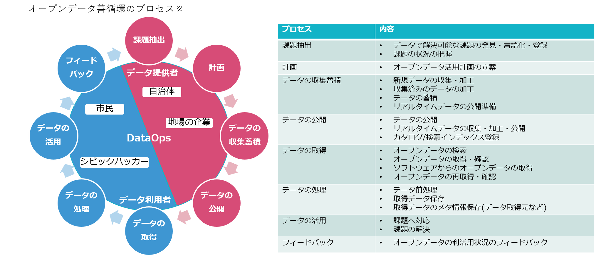

# DataOpsを活用したオープンデータ利活用に関する報告書

Version：0.1  
公開日：2024年xx月xx日  
著者：C3Lab

　By C3Lab

このドキュメントの内容物は [クリエイティブ・コモンズ 表示 4.0 ライセンス](http://creativecommons.org/licenses/by/4.0/deed.ja) [^1]の下に提供されています。

## 目次

[**１ はじめに**](#１-はじめに)  

[１-１ 本報告書の位置づけ](#本報告書の位置づけ)  
[１-２ 背景](#背景)  

[**２ 検証イベント実施内容**](#２-検証イベント実施内容)  

[２-１ オープンデータDataOps検証イベント](#オープンデータdataops検証イベント)  
[２-２ 検証イベント詳細](#検証イベント詳細)  
[２-３ イベントにて実施したアンケート結果](#イベントにて実施したアンケート結果)  

[**３ 考察**](#３-考察)  

[**４ まとめ**](#４-まとめ)  

[**５ 今後の展望**](#５-今後の展望)  

## **１ はじめに**

### **本報告書の位置づけ**
2022年度版の「[DataOpsを活用したオープンデータ利活用に関する報告書](opendata_dataops.md)」（以下、2022年度報告書）で提案したDataOpsプロセスのオープンデータ利活用への有効性を確認する為、その最初のアプローチとして、DataOpsプロセスの作業を体験する開発イベントを開催した。  
本報告書は開発イベントで得た成果や課題を元に、有効性を確認する為の改善案をとりまとめたものである。  

### 背景
2022年度報告書ではオープンデータ利活用の阻害要因例として以下の問題が確認されている。
- 必要なデータが探しづらい
- 必要なデータが公開されていない
- オープンデータの認知度が低い
- 利用者のニーズが解らない

この阻害要因を解消する為の手法としてDataOpsの概念に焦点を当てている。

#### DataOpsとは
ガートナー社の定義[^2]によると「組織全体のデータ管理者とデータ利用者の間のコミュニケーションの向上と、データフローの統合と自動化の改善に焦点を当てた共同作業によるデータ管理の手法」と定義している。DataOpsの概念を利用することで、利用者が必要なタイミングで信頼できるデータや分析結果を入手可能となり、データの利用者と提供者が協調することでプロセス、ツール環境や組織文化の継続的な改善が期待できる。  

この概念を利用することでこれらの阻害要因を解消することが可能であるという仮説に基づき、DataOpsのプロセスを提案した。  

以下の図は、提案したDataOpsのプロセス図とその内容である。

※各ステークホルダーやユースケースの詳細については[2022年度報告書](opendata_dataops.md)を参照  

この提案の有効性については検証中であり、有効性の確認の為、イベントを行うこととした。

## ２ 検証イベント実施内容

### **オープンデータDataOps検証イベント**
検証イベントとして以下のイベントを実施した。  
- Social Hack Day #56 2023年12月16日開催
- Social Hack Day #57 2024年01月20日開催
- Social Hack Day #58 2024年02月17日開催

### **検証イベント詳細**

#### **Social Hack Day #56**  (イベント詳細：[Social Hack Day #56 イベントレポート](event/event_report_20231216.md))  

##### 概要
データ利用者がオープンデータを活用する方法として、データの可視化があげられる。  
本イベントではデータの可視化を行う際に有用なデータ構成について、データ提供者のプロセスである「データの収集蓄積」を通して議論し、このプロセスの有効性を確認する。  

##### 成果  
<table border="1">
  <thead>
    <tr style="text-align:center">
      <th width="600px" rowspan="2">成果</th>
      <th colspan="8">関連するDataOpsプロセス</th>
    </tr>
    <tr>
      <th style="writing-mode: tb-rl;">課題抽出</th><th style="writing-mode: tb-rl;">計画</th><th style="writing-mode: tb-rl;">データの収集蓄積</th><th style="writing-mode: tb-rl;">データの公開</th><th style="writing-mode: tb-rl;">データの取得</th><th style="writing-mode: tb-rl;">データの処理</th><th style="writing-mode: tb-rl;">データの活用</th><th style="writing-mode: tb-rl;">フィードバック</th>
    </tr>
  </thead>
  <tbody>
    <tr>
      <td>国の制度関連の取り組みを行っているプロジェクトでDataOpsの概念を組み込んでいきたいという意見が上がった</td>
      <td></td><td></td><td></td><td></td><td></td><td></td><td></td><td></td>
    </tr>
    <tr>
      <td>自治体がオープンデータを提供するプロセスを体験することで、作業量等の観点から自治体職員が手作業でデータ加工を行うのは現実的ではないということを実感した</td>
      <td></td><td></td><td>○</td><td></td><td></td><td></td><td></td><td></td>
    </tr>
    <tr>
      <td>オープンデータ提供者にとって生成系AIによるレビューが有効な手段であることを実感できた</td>
      <td></td><td></td><td>○</td><td></td><td></td><td></td><td></td><td></td>
    </tr>
    <tr>
      <td>フィードバックをトリガーとしてDataOpsプロセスの課題抽出・計画・データの公開・取得・活用の要素を満たす機能を有しているCKAN拡張機能（ckanext-feedback）をイベント参加者が実際に体験することでDataOpsプロセスにおける善循環サイクルへの理解を促進できた</td>
      <td>○</td><td>○</td><td></td><td>○</td><td>○</td><td></td><td>○</td><td>○</td>
    </tr>
    <tr>
      <td>博物館では所蔵品のデータの提供を積極的に実施している為、カルチャーの領域でも活用してみたいという意見が上がった</td>
      <td></td><td></td><td></td><td></td><td></td><td></td><td></td><td></td>
    </tr>
    <tr>
      <td>ChatGPTを使ってデータ構造についてレビューを実施したところ問題点と改善に関するアイデアを検討してくれた</td>
      <td></td><td></td><td>○</td><td></td><td></td><td></td><td></td><td></td>
    </tr>
    <tr>
      <td>ChatGPTによる可視化は細かい要求に対しても適切にデータを生成してくれる為、データ利用者にとって活用できるツールであることを実感した</td>
      <td></td><td></td><td></td><td></td><td></td><td></td><td>○</td><td></td>
    </tr>
  </tbody>
</table>

##### 課題  
<table border="1">
  <thead>
    <tr style="text-align:center">
      <th width="600px" rowspan="2">課題</th>
      <th colspan="8">関連するDataOpsプロセス</th>
    </tr>
    <tr>
      <th style="writing-mode: tb-rl;">課題抽出</th><th style="writing-mode: tb-rl;">計画</th><th style="writing-mode: tb-rl;">データの収集蓄積</th><th style="writing-mode: tb-rl;">データの公開</th><th style="writing-mode: tb-rl;">データの取得</th><th style="writing-mode: tb-rl;">データの処理</th><th style="writing-mode: tb-rl;">データの活用</th><th style="writing-mode: tb-rl;">フィードバック</th>
    </tr>
  </thead>
  <tbody>
    <tr>
      <td>オープンデータがPDFで公開されている為、データ利用者は扱いづらい</td>
      <td></td><td></td><td>○</td><td>○</td><td></td><td>○</td><td>○</td><td></td>
    </tr>
    <tr>
      <td>自動化して効率的にデータの整形を行いたい</td>
      <td></td><td></td><td>○</td><td></td><td></td><td></td><td></td><td></td>
    </tr>
    <tr>
      <td>自治体側がファイルに変更を加えた際、その変更がデータ利用時に大きな障害になってしまう場合がある為（想定外の項目が追加されている等）、相互のコミュニケーションが必要だと感じた</td>
      <td></td><td></td><td>○</td><td></td><td></td><td></td><td>○</td><td></td>
    </tr>
    <tr>
      <td>以下の理由から初めにフォーマットを用意しておく必要性を実感した ● 地域ごとにフォーマットが異なる ● 半角全角、記号などの統一が行われていない ● 自治体がオープンデータに加えた工夫で、かえって扱いにくいデータ形式になってしまっている</td>
      <td></td><td></td><td>○</td><td></td><td></td><td>○</td><td>○</td><td></td>
    </tr>
    <tr>
      <td>大元のデータが更新されると、リンクが無効になってしまう問題が発生したため、データ更新の際、何かアナウンスがあるべきだと感じた</td>
      <td></td><td></td><td></td><td>○</td><td>○</td><td></td><td></td><td></td>
    </tr>
    <tr>
      <td>文化資源の領域のオープンデータも利活用したいという意見があったが、オープンデータの認知度や法整備などの課題がある</td>
      <td></td><td>○</td><td></td><td></td><td></td><td></td><td></td><td></td>
    </tr>
    <tr>
      <td>ChatGPTが出してくれたデータ構造は細かく、確かに正しいが項目が大量になってしまうためデータ作成のコストがかかる</td>
      <td></td><td></td><td>○</td><td></td><td></td><td></td><td></td><td></td>
    </tr>
    <tr>
      <td>CKANにオープンデータを公開するにあたりバージョンを意識する必要があるが、有識者のサポートが必要になる可能性が高い</td>
      <td></td><td></td><td></td><td>○</td><td></td><td></td><td></td><td></td>
    </tr>
    <tr>
      <td>ChatGPTによる可視化はデータ利用者にとって活用できるツールではあるが、指示文のちょっとしたニュアンスの違いで結果が変わってしまうこともある為、必ず結果が確かなものかを確認する必要がある</td>
      <td></td><td></td><td></td><td></td><td></td><td></td><td>○</td><td></td>
    </tr>
  </tbody>
</table>

#### **Social Hack Day #57**  (イベント詳細：[Social Hack Day #57 イベントレポート](event/event_report_20240120.md))  

##### 概要  
[Social Hack Day #56](#social-hack-day-56-イベント詳細social-hack-day-56-イベントレポート)で議論したデータの収集蓄積プロセス及びフィードバックプロセスの有効性を確認した。  

データの収集蓄積プロセスは、データ利用者がデータを有効に活用する為のデータ構造に関して継続議論した。  

フィードバックプロセスは、データ提供者のモチベーションをあげる（利活用促進につなげる）ためにはどうすべきかについてデータ利用者・データ提供者それぞれの観点で議論した。  

最後にデータの収集蓄積やデータの活用プロセスに使用することを想定して開発したAssistants API UIツールのデモを実施し、意見交換を行った。

##### 成果  

<table border="1">
  <thead>
    <tr style="text-align:center">
      <th width="600px" rowspan="2">成果</th>
      <th colspan="8">関連するDataOpsプロセス</th>
    </tr>
    <tr>
      <th style="writing-mode: tb-rl;">課題抽出</th><th style="writing-mode: tb-rl;">計画</th><th style="writing-mode: tb-rl;">データの収集蓄積</th><th style="writing-mode: tb-rl;">データの公開</th><th style="writing-mode: tb-rl;">データの取得</th><th style="writing-mode: tb-rl;">データの処理</th><th style="writing-mode: tb-rl;">データの活用</th><th style="writing-mode: tb-rl;">フィードバック</th>
    </tr>
  </thead>
  <tbody>
    <tr>
      <td>データをどこまで構造化するべきかはユースケースによって変わる為、ニーズに合わせて変更可能な最小限の構造（名称、住所などの共通部分のみ）であるべきことがわかった</td>
      <td></td><td></td><td>○</td><td></td><td></td><td></td><td></td><td></td>
    </tr>
    <tr>
      <td>ChatGPTを使用したデータ構造のレビューやデータの可視化の体験を通して、データの構造化や検索用としてChatGPTを活用することの将来性を実感できた</td>
      <td></td><td></td><td>○</td><td>○</td><td>○</td><td></td><td></td><td></td>
    </tr>
    <tr>
      <td>オープンデータのニーズの収集は東京都職員の方がハッカソンや企業へのヒアリングを通して行っていることがわかった</td>
      <td>○</td><td></td><td></td><td></td><td></td><td></td><td></td><td>○</td>
    </tr>
    <tr>
      <td>オープンデータが循環している流れを可視化することで、さらにサイクルの加速が期待できるという意見があがった</td>
      <td></td><td></td><td></td><td></td><td></td><td></td><td>○</td><td></td>
    </tr>
    <tr>
      <td>オープンデータ作成支援AIの課題（以下課題表中に記載）を把握することができた</td>
      <td></td><td></td><td>○</td><td></td><td></td><td></td><td>○</td><td></td>
    </tr>
  </tbody>
</table>

##### 課題  

<table border="1">
  <thead>
    <tr style="text-align:center">
      <th width="600px" rowspan="2">課題</th>
      <th colspan="8">関連するDataOpsプロセス</th>
    </tr>
    <tr>
      <th style="writing-mode: tb-rl;">課題抽出</th><th style="writing-mode: tb-rl;">計画</th><th style="writing-mode: tb-rl;">データの収集蓄積</th><th style="writing-mode: tb-rl;">データの公開</th><th style="writing-mode: tb-rl;">データの取得</th><th style="writing-mode: tb-rl;">データの処理</th><th style="writing-mode: tb-rl;">データの活用</th><th style="writing-mode: tb-rl;">フィードバック</th>
    </tr>
  </thead>
  <tbody>
    <tr>
      <td>オープンデータの利用者と提供者一人一人のモチベーションをあげる仕組みが必要</td>
      <td></td><td></td><td></td><td></td><td></td><td></td><td></td><td>○</td>
    </tr>
    <tr>
      <td>データを構造化しすぎることでデータ提供者の作業コストが増加してしまう</td>
      <td></td><td></td><td>○</td><td></td><td></td><td></td><td></td><td></td>
    </tr>
    <tr>
      <td>データ提供者とデータ利用者の間を仲介する（データを構造化する）ステークホルダが善循環のサイクルに存在しない</td>
      <td></td><td></td><td>○</td><td></td><td></td><td></td><td></td><td></td>
    </tr>
    <tr>
      <td>オープンデータを整備する部署と公開する部署が異なる場合、フィードバックコメントを読まないことがある為、データ利用者の声がデータを整備する部署の担当者まで届かない</td>
      <td></td><td></td><td></td><td></td><td></td><td></td><td></td><td>○</td>
    </tr>
    <tr>
      <td>利用者が提供者に対して感謝の意識をもてるような仕組みが必要</td>
      <td></td><td></td><td></td><td></td><td></td><td></td><td>○</td><td>○</td>
    </tr>
    <tr>
      <td>フィードバックには報告、要望などの種類があるが、ネガティブな要素を可能な限り減らす為には「データのこの部分を修正しました」のような報告ベースのフィードバックであるべき</td>
      <td></td><td></td><td></td><td></td><td></td><td></td><td></td><td>○</td>
    </tr>
    <tr>
      <td>提供者はフィードバックとして返ってきたデータを修正する際に、責任やチェック作業にかかるコストに抵抗感を感じる恐れがある</td>
      <td></td><td></td><td>○</td><td></td><td></td><td></td><td></td><td>○</td>
    </tr>
    <tr>
      <td>DataOpsのスタートは利用者のニーズ収集から始まるため、それをサポートする仕組みが必要</td>
      <td>○</td><td></td><td></td><td></td><td></td><td></td><td></td><td>○</td>
    </tr>
    <tr>
      <td>ChatGPTを活用する上で、正しく解釈できるデータ構造とは何かについて検討する必要がある</td>
      <td></td><td></td><td>○</td><td></td><td></td><td></td><td>○</td><td></td>
    </tr>
    <tr>
      <td>欲しいデータを投票できる仕組みなど、楽にニーズを表明できる環境が必要</td>
      <td>○</td><td></td><td></td><td></td><td></td><td></td><td></td><td></td>
    </tr>
    <tr>
      <td>オープンデータ作成支援AIに検索させる場合、検索のたびにすべてのデータを参照するのは非効率である為、必要な情報に関してはある程度の構造化が必要</td>
      <td></td><td></td><td>○</td><td></td><td></td><td></td><td></td><td></td>
    </tr>
    <tr>
      <td>オープンデータ作成支援AIを使用する際、プロンプトのテクニックや処理できるデータ件数の限界を把握する必要がある</td>
      <td></td><td></td><td>○</td><td></td><td></td><td></td><td>○</td><td></td>
    </tr>
  </tbody>
</table>

#### **Social Hack Day #58**  (イベント詳細：[Social Hack Day #58 イベントレポート](event/event_report_20240217.md))  

##### 概要  
[Social Hack Day #57](#social-hack-day-57-イベント詳細social-hack-day-57-イベントレポート)で議論した、データ提供者とデータ利用者の間を仲介する二次データ提供者の作業プロセスにフォーカスを当て、そのプロセスの一部を実際に実施した。  

二次データ提供者の作業プロセスは既存のDataOpsプロセスには存在しない為、以下を想定。  

1. 一次データ提供者(データ提供者：自治体職員など)が公開したデータを取得する（二次データ提供者によるデータ取得プロセス）
2. 取得したデータを機械判読可能なデータへ加工する  （二次データ提供者によるデータ処理プロセス）
3. データ利用者が利用できる形で提供・公開を行う（二次データ提供者によるデータ公開プロセス）
4. 一連のプロセスをCIなどで自動化する（二次データ提供者による自動化プロセス）

今回はこのうち、1、2、4の作業を実施した。  
実際の作業内容としては以下の通り。  

- 厚労省が公開している「緊急避妊薬医療機関」のPDFデータ一括取得（dimによるデータ更新管理含む）
- 取得したPDFデータのCSV変換（フォーマットが異なるPDFについても考慮）
- PDF取得からCSV変換までの GitHub Actions による自動化

##### 成果  

<table border="1">
  <thead>
    <tr style="text-align:center">
      <th width="600px" rowspan="2">成果</th>
      <th colspan="8">関連するDataOpsプロセス</th>
    </tr>
    <tr>
      <th style="writing-mode: tb-rl;">課題抽出</th><th style="writing-mode: tb-rl;">計画</th><th style="writing-mode: tb-rl;">データの収集蓄積</th><th style="writing-mode: tb-rl;">データの公開</th><th style="writing-mode: tb-rl;">データの取得</th><th style="writing-mode: tb-rl;">データの処理</th><th style="writing-mode: tb-rl;">データの活用</th><th style="writing-mode: tb-rl;">フィードバック</th>
    </tr>
  </thead>
  <tbody>
    <tr>
      <td>tabulaとpandasを用いたPDF→CSV変換で、改行コードを置換することで変換することに成功した</td>
      <td></td><td></td><td></td><td></td><td></td><td>○</td><td></td><td></td>
    </tr>
    <tr>
      <td>dimの機能を活用して、PDFを取得することに成功した</td>
      <td></td><td></td><td></td><td></td><td>○</td><td></td><td></td><td></td>
    </tr>
    <tr>
      <td>CIによって定期的（1日1回）にPDFを一括ダウンロードし、CSVに自動変換するツールが完成した</td>
      <td></td><td></td><td></td><td></td><td>○</td><td>○</td><td></td><td></td>
    </tr>
  </tbody>
</table>

##### 課題  

<table border="1">
  <thead>
    <tr style="text-align:center">
      <th width="600px" rowspan="2">課題</th>
      <th colspan="8">関連するDataOpsプロセス</th>
    </tr>
    <tr>
      <th style="writing-mode: tb-rl;">課題抽出</th><th style="writing-mode: tb-rl;">計画</th><th style="writing-mode: tb-rl;">データの収集蓄積</th><th style="writing-mode: tb-rl;">データの公開</th><th style="writing-mode: tb-rl;">データの取得</th><th style="writing-mode: tb-rl;">データの処理</th><th style="writing-mode: tb-rl;">データの活用</th><th style="writing-mode: tb-rl;">フィードバック</th>
    </tr>
  </thead>
  <tbody>
    <tr>
      <td>オープンデータとして公開されているPDFが定期的に更新され、リンク切れが発生してしまう → dimによるデータ更新管理で対応</td>
      <td></td><td></td><td></td><td></td><td>○</td><td></td><td></td><td></td>
    </tr>
    <tr>
      <td>リンク切れの判別は、PDFをダウンロードして確認するか、サイトの最終更新で確認するしかない → dimによるデータ更新管理で対応</td>
      <td></td><td></td><td></td><td></td><td>○</td><td></td><td></td><td></td>
    </tr>
    <tr>
      <td>dimによるPDF取得時に2ファイルほど関係のないファイルが混ざっている</td>
      <td></td><td></td><td></td><td></td><td>○</td><td></td><td></td><td></td>
    </tr>
    <tr>
      <td>PDFを一括ダウンロードして、csvのような機械可読性の高いものに自動変換したい → イベント内で作成完了</td>
      <td></td><td></td><td></td><td></td><td>○</td><td>○</td><td></td><td></td>
    </tr>
    <tr>
      <td>Robocorpを使用したPDF→CSV変換ではPDF内のテーブルが認識されずテキストとして出力されてしまう</td>
      <td></td><td></td><td></td><td></td><td></td><td>○</td><td></td><td></td>
    </tr>
    <tr>
      <td>tabulaとpandasを用いたPDF→CSV変換を行う際、以下の課題を確認 ● 変換後、出力されたCSVがPDFのページ毎にわかれてしまう → イベント内で対応済 ● PDFのヘッダーが毎回記述されてわかりにくい</td>
      <td></td><td></td><td></td><td></td><td></td><td>○</td><td></td><td></td>
    </tr>
    <tr>
      <td>各都道府県によってフォーマットの差異がある（１ページ目だけにヘッダーが記載されている、独自の列があるなど）</td>
      <td></td><td></td><td></td><td></td><td></td><td>○</td><td></td><td></td>
    </tr>
    <tr>
      <td>データが公開されているページにPDFの追加や順番の入れ替わり等が発生するとPDFの更新取得処理に失敗する可能性がある → CIが落ちることで検知可能</td>
      <td></td><td></td><td></td><td></td><td>○</td><td></td><td></td><td></td>
    </tr>
    <tr>
      <td>今回のPDF→CSV変換処理は、幅広い分野のオープンデータに対しても検証を進めた方がいい</td>
      <td></td><td></td><td></td><td></td><td></td><td>○</td><td></td><td></td>
    </tr>
  </tbody>
</table>

### イベントにて実施したアンケート結果

DataOpsのプロセスがオープンデータ利活用促進につながるかの根拠を得る為、イベント参加者にアンケートを実施した。

- [アンケート結果(12月開催分)](event/survey/survey_20231216.md)   
- [アンケート結果(2月開催分)](event/survey/survey_20240217.md) 

## **３ 考察**  

2022年度報告書で提案したDataOpsプロセスのオープンデータ利活用への有効性を確認する為、その最初のアプローチとして検証イベントを開催した。  

イベントを開催した結果、背景に記載した以下2点の問題を確認することができた。

- 必要なデータが公開されていない  
- 利用者のニーズが解らない  

検証イベントの中で行われたディスカッションやアンケートの結果から、新たに以下の課題が見つかった。  

1. データ利用者が利活用しづらい形式のデータが存在する
2. データ利用者が利活用しやすい(※1)データへ加工する作業が必要となる
3. データ提供者のモチベーション維持が難しい

※1 利活用しやすいデータとは、機械判読(※2)可能なデータを指す。  
公開されているPDFは、データを利用する際に機械判読可能なデータへの変換（PDFからCSVなど）が必要となる可能性が高い。実施したイベントにおいても、PDFからCSVへ変換を実施した。  

※2 機械判読とはコンピュータプログラムが自動的にデータを加工、編集等ができること  

この課題を改善させる方法としては以下が考えられる。  

1. データ利用者が利活用しやすいデータを増やす  
2. 二次データ提供者という役割とプロセスを増やす  
3. 生成AIを活用する  
4. データ利用者からのフィードバックを増やす  

これらの改善方法の詳細について、以下に記載する。  

### 改善方法詳細

#### データ利用者が利活用しやすいデータを増やす

2024年3月5日時点で公開されているオープンデータ[^3]191,534件のうち、43,220件の約23%がPDF形式で公開されている。  
自治体によって差異があるが、まだデータ利用者にとって利活用しづらい形式で公開している場所が多く存在する。  
また、構造化されていても不要な改行やスペースなどが入っていることで、データ利用者にとって利活用しづらいデータとなっている。  
検証イベントで利用したデータに関しても、不要な改行やスペースなどがあり、利用する際のデータ加工作業に時間がかかることがわかった。  

対策としては、デジタル庁が公開しているGIF(政府相互運用性フレームワーク)[^4]や自治体標準オープンデータセット[^5]の形式に統一して、利用者が扱いやすいデータで公開することが考えられる。  

ただし、この形式に変換することは、ITやオープンデータに関する知見が必要であることが想定される為、データ提供者側でこの対応をすることは大きな負担になると考えられる。  
その為、この変換プロセスについては別途改善が必要だと考えられる。  

#### 二次データ提供者という役割とプロセスを増やす

前述の通り、扱いやすいデータを公開するには、デジタル庁が公開しているGIFや自治体標準オープンデータセットに準拠する必要があると考えられる。  
しかし、以下の理由から、データ提供者側でこの対応を実施することは大きな負担になることが想定される。  

- ITやオープンデータに精通した人の知見が必要
- 作業コストがかかる

対策としては、データ提供者とデータ利用者の間を仲介する（機械判読可能なデータに加工する）ステークホルダを設け、二次データ提供者としてデータの取得、データの処理をするプロセスをDataOpsプロセスに追加することが考えられる。  

この対策を実施することで、データ提供者に負担をかけずに、扱いやすいデータをデータ利用者が使えるようになると考えられる。  
また、データ提供者の負担を軽減することで、データ公開に対する抵抗感をやわらげることにつながり、データ公開及びデータ活用の促進につながると考えられる。  

ただし、この改善策を実施する前提として、二次データ提供者を担当する人物が必須となる為、誰がその役割を担うかが課題となる。  

##### 二次データ提供者について

二次データ提供者について、その位置づけを以下に記載する。  

###### 二次データ提供者の対象プロセス

二次データ提供者は以下プロセスの実施を想定している。

- 一次データ提供者(データ提供者：自治体職員など)が公開したデータを取得する（DataOpsプロセスにおけるデータの取得）
- 取得したデータを機械判読可能なデータへ加工する（DataOpsプロセスにおけるデータの処理）  
加工するフォーマット例：GIF や 自治体標準オープンデータセット
- データ利用者が利用できる形で提供・公開を行う（DataOpsプロセスにおけるデータの公開）
- 一連のプロセスをCIなどで自動化する

検証イベントでは、厚労省が公開している「緊急避妊薬医療機関」のPDFを一括ダウンロードし、CSVデータへ変換するプロセスを自動化することに成功した。  
しかし、以下のような課題がまだ残っている為、今後もさらに検討を進める必要があると考えられる。  
- 変換したCSVに不要な改行や余計なヘッダー情報が含まれている
- 他のオープンデータに関しても「[Social Hack Day #58](#social-hack-day-58-イベント詳細social-hack-day-58-イベントレポート)」の課題に記載したような問題が発生する可能性がある為、幅広いオープンデータに対して検証を進める必要がある

###### 二次データ提供者となりうるステークホルダ

GIFや自治体標準オープンデータセットに準拠した機械判読可能なデータへの加工、及びプロセスの自動化は、ITやオープンデータに関する知見が必要であると考えられる。  
その為、二次データ提供者となりうるステークホルダとしては、どちらにも精通している可能性のあるシビックハッカーが候補として考えられる。  
また、将来的にはエコシステムとしての新たなステークホルダが必要になる可能性も考えられる。  

今回検証イベントで実施した際は、イベント参加者自身がこの役割を担当した。  

###### 二次データ提供者による効果

二次データ提供者が、機械判読可能なデータへ加工する作業コストを担うことで、データ提供者に負担をかけずに扱いやすいデータをデータ利用者が使えるようになると考えられる。  
また、データ提供者は作業コストの低減に加え、扱いやすいデータを意識することなくデータを公開することが可能になると考えられる為、データ公開に対する抵抗感をやわらげることにつながると考えられる。  
その結果、データ活用及びデータ公開の促進につながると考えられる。  

#### 生成AIを活用する

検証イベントを通じて、生成AIのChatGPTが、データ加工やデータ活用に利用できる可能性があることがわかった。  

作成したデータのレビューなどをChatGPTで実施することで、機械判読可能なデータにする為の提案を作業コストを抑えて実施することが可能になると考えられる。  
また、データ可視化などのデータ活用の場においても、少ない労力で位置情報をマッピングしたHTMLデータを生成することが可能になると考えられる。  

ただし、以下の課題に関しては引き続き検討する必要がある。  

- AIが適切な応答や結果を生成するためのプロンプトのテクニックが必要
- ハルミネーション(※3)を起こしてしまうことがある為、レスポンス内容が確かなものであるかの確認が必要
- 細かい指摘や修正を命令するためには結局ITの知識が必要となる

※3 ハルミネーションとは人工知能（AI）が事実に基づかない情報を生成する現象  

#### データ利用者からのフィードバックを増やす

データを有効に活用していく為には利用者のニーズに応じたメンテナンスを継続的に実施する必要がある。  
ニーズの把握や、データ提供者のモチベーションを維持する目的としても「フィードバック」プロセスは重要な役割を持つと考えられる。  

フィードバックの仕組みを実現する方法の一つとして、OSSとして公開されているCKAN拡張機能（ckanext-feedback）[^6]を活用する方法が挙げられる。  
CKAN拡張機能はデータセットに対する評価や「要望、質問、宣伝、感謝」のフィードバックコメントを記載できるようになっている。  

データ提供者にとってモチベーションが向上するフィードバックを実施することが、データ提供におけるモチベーション維持につながると考える。  
モチベーションを向上させるフィードバックとしては、ポジティブなフィードバックやネガティブな要素を排除したフィードバックが考えられる。

例えば、ポジティブなフィードバックとしては、評価や具体的な活用事例の報告、「素晴らしいデータをありがとう」などの感謝のメッセージなどが考えられる。
そして、ネガティブな要素を排除したフィードバックとしては、オープンデータに修正が必要なケースの場合、「データの○○が間違っています」のようなIssue形式ではなく、「データの○○部分を修正しました」のような Pull Request 形式でのフィードバックなどが考えられる。  

データ提供者のモチベーションを維持する為には、このようなフィードバックを促す仕組みの検討が今後必要であると考える。

## **４ まとめ**  

検証イベントでのDataOpsプロセスのオープンデータ利活用への有効性を確認する過程で、新たに以下の課題が見つかった。

1. データ利用者が利活用しづらい形式のデータが存在する  
2. データ利用者が利活用しやすいデータへ加工する作業が必要となる  
3. データ提供者のモチベーション維持が難しい  

これらの課題を改善させる為の方法として、以下を提案した。

1. データ利用者が利活用しやすいデータを増やす  
2. 二次データ提供者という役割とプロセスを増やす  
3. 生成AIを活用する  
4. データ利用者からのフィードバックを増やす  

この改善方法により、DataOpsプロセスは以下のような善循環のサイクルをまわすことが可能になると考えられる。  
結果、必要なデータが公開されるようになり、利用者のニーズも把握することが可能になると考えられる。

1. データ提供者は扱いやすいデータを意識することなくデータを公開する  
2. 二次データ提供者は GIF or 自治体標準オープンデータセット に準拠したデータを作成する  
3. データが扱いやすい為、データ利用者が増える  
4. データ利用者が増えることでフィードバックも活性化する  
5. データ利用者はデータ提供者、二次データ提供者に対してポジティブ、及びネガティブ要素を含まないフィードバックを実施する  
6. データ提供者、二次データ提供者はモチベーションを維持したままフィードバックを取込、ニーズのあるデータを提供し続ける  

この善循環のサイクルを実現する為には、二次データ提供者を担当する人物が必要となる点が今後の課題になると考えられる。  

## **５ 今後の展望**  
オープンデータにDataOpsのプロセスを適用することがオープンデータの利活用促進につながることを証明した。
これを踏まえ、データ利用者/データ提供者への認知のさらなる普及、ひいては政府/自治体まで普及させることを目指し、日本のオープンデータの改善及び活用促進に寄与する。

## **参考文献**
[^1]: クリエイティブ・コモンズ・ライセンス, “クリエイティブ・コモンズ・ライセンス,” [オンライン]. Available: https://creativecommons.org/licenses/by/4.0/. [アクセス日: 16 09 2022].
[^2]: Gartner, Inc. and/or its affiliates., “Press Releases,” 11 9 2018. [オンライン]. Available: https://www.gartner.com/en/newsroom/press-releases/2018-09-11-gartner-hype-cycle-for-data-management-positions-three-technologies-in-the-innovation-trigger-phase-in-2018. [アクセス日: 29 8 2022].  
[^3]: SIP NIIコンソーシアム, "データカタログ横断検索システム" [オンライン]. Available: https://search.ckan.jp/. [アクセス日: 05 03 2024].  
[^4]: Digital Agency,Government of Japan, "政府相互運用性フレームワーク（GIF）" [オンライン]. Available: https://www.digital.go.jp/policies/data_strategy_government_interoperability_framework. [アクセス日: 20 02 2024].  
[^5]: Digital Agency,Government of Japan, "自治体標準オープンデータセット（正式版）" [オンライン]. Available: https://www.digital.go.jp/resources/open_data/municipal-standard-data-set-test. [アクセス日: 20 02 2024].  
[^6]: C3Lab, "ckanext-feedback" [オンライン]. Available: https://github.com/c-3lab/ckanext-feedback. [アクセス日: 26 02 2024].   
